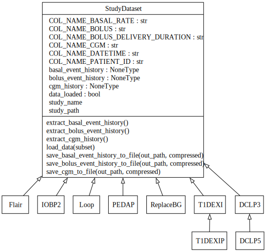

# BabelBetes
The BabelBetes project aims to standardize publicly available clinical trial data on continuous glucose monitoring (CGM) and insulin pump delivery, reducing the costs and time associated with data translation for researchers. Motivated by the challenges of inconsistent data formats, BabelBetes will streamline access to usable datasets, accelerating innovation in type 1 diabetes care.​

### Challenges with Publicly Available Clinical Trial Data
Data is the raw material from which models are developed, simulations are composed, and new therapies to reduce the burden of living with type 1 diabetes are developed.

Clinical trials performed at great time and expense, funded by Breakthrough T1D, HCT, and NIH have provided large volumes of granular data which is often stored publicly (www.jaeb.org) or otherwise readily accessible (OPEN Project, OpenAPS, Nightscout Data Commons).

Unfortunately this is often the only data available to researchers and developers seeking to provide innovative solutions for people with type 1 diabetes, putting them at great disadvantage relative to leading medical device companies who together gather more data per day than exists in the entire public domain, ever (approximately 500,000 subject-days).

To add to this, public available data is not stored with consistent methods or formats, resulting in a confusing array of file formats and data descriptors which must be translated at great effort and with high probability of error by each and every researcher or developer hoping to gain insights.

### Last Mile Problem
Babelbetes addresses this “last mile” problem by developing a publicly available set of tools to normalize clinical diabetes trial datasets, focusing on continuous glucose monitoring and insulin pump delivery. Babelbetes also provides recommendations on a normalized data set format to ensure future activities provide shovel-ready data for researchers and developers.

This is the [official project documentation](https://nudgebg.github.io/egvinsulin)

## Supported Studies

The goal is to work with as many clinical diabetes trial datasets as possible. At the moment, the following datasets from the diabetes [JAEB database](https://public.jaeb.org/datasets/diabetes) are supported. 

For each of these studies, we've spent hundreds of hours analyzing the data to ensure that the class correctly loads and extracts the data. Please refer to the study analysis pages for a summary of the analysis and findings that went into each dataset. While we operated with great care, some asumptions had to be made and other details remain unknown which are also documented.

|**Analysis & Documentation**|Link|Retrieval Date|Folder Name *|Note|
|-|-|-|-|-|
|[Flair](./data_sets/FLAIR.md)|[JAEB](https://public.jaeb.org/dataset/566)| April 17th, 2024|FLAIRPublicDataSet|In the newest version (September, 2024) JAEB insulin pump data was removed from the study dataset.|
|[DCLP3](./data_sets/DCLP3.md)|[JAEB](https://public.jaeb.org/dataset/573)|April 17th, 2024|DCLP3 Public Dataset - Release 3 - 2022-08-04 |-|
|[DCLP5](./data_sets/DCLP5.md)|[JAEB](https://public.jaeb.org/dataset/535)|April 17th, 2024|DCLP5_Dataset_2022-01-20-5e0f3b16-c890-4ace-9e3b-531f3687cf53|-|
|[IOBP2](./data_sets/IOBP2.md)|[JAEB](https://public.jaeb.org/dataset/579)|April 17th, 2024|IOBP2 RCT Public Dataset|-|
|[PEDAP](./data_sets/PEDAP.md)|[JAEB](https://public.jaeb.org/dataset/599)|September, 26th, 2024|PEDAP Public Dataset - Release 3 - 2024-09-25|Our investigation resulted in this updated version with corrected patient ids.|
|[T1DEXI](./data_sets/T1DEXI.md)|[JAEB](https://public.jaeb.org/dataset/589)|October 1st, 2022|T1DEXI|Currently, the toolbox requires all datatables to be extracted and be placed in the T1DEXI folder|
|[T1DEXIP](./data_sets/T1DEXIP.md)|[JAEB](https://public.jaeb.org/dataset/590)|March 16th, 2023|T1DEXIP|Currently, the toolbox requires all datatables to be extracted and be placed in the the T1DEXIP folder|
|[REPLACE BG](./data_sets/REPLACE_BG.md)|[JAEB](https://public.jaeb.org/dataset/546)|February 2nd, 2025|REPLACE-BG Dataset-79f6bdc8-3c51-4736-a39f-c4c0f71d45e5|The currently hosted version misses the Basal file.|
|[Loop](./data_sets/LOOP.md)|[JAEB](https://public.jaeb.org/dataset/560)|September 2nd, 2024|Loop study public dataset 2023-01-31|-|

\* We have only tested our code on the respective versions. Therefore, the folder names are currently hard-coded and should match with the names above

## How to Contribute
BabelBetes was funded to be freely available, helping researchers and companies save costs and time, and supercharge innovation in diabetes care. 

We’re incredibly excited for contributions that will expand its functionality and support even more datasets, making a bigger impact than ever before! 

Learn more about [how to contribute](./contribute.md).

## Key Features of the Toolbox
 
 **1. Analaysis scripts and and documentation**: You can learn about the datasets and what challenges came with normalizing tem by consulting the dataset summaries. You might also consult and review the jupyter notebooks that document our analysis.

 **2. Python modules**: You can use the python modules to extract standardized continuous glucose monitor (CGM) and insulin pump data from the supported study datasets. Reuse the helper and drawing functions to work with the data.
  - Extend the functionality of existing study classes or add new implementations of the StudyDataset base class to support additional study datasets. 

 **3. Recommendations**: As guidance for investigators, we've summarized our learnings and challanges in a list of recommendations that we believe would dramatically improve the quality and usability of datasets published in the future.

### Data Standardization
The ultimate purpose of this toolbox is to bring CGM and insulin data into a common standardized format. We chose to abstract study datasets as objects. Each study class derives from the parent `StudyDataset` class and overrides methods to extract cgm, bolus and basal data. The StudyDataset base class defineds methods to extract cgm, basal and bolus data in standardized pandas dataframes.



For example, the bolus dataframe obtained with `extract_bolus_event_history()` has this format:

| Column Name | Type| Description|
|----|----|----|
| `patient_id`       | `str`              | Patient ID|
| `datetime`         | `pd.Timestamp`     | Datetime of the bolus event  |
| `bolus`            | `float`            | Actual delivered bolus amount in units|
| `delivery_duration`| `pd.Timedelta`     | Duration of the bolus delivery|

refer to the [Code Reference](./reference/#studies.studydataset.StudyDataset) for more details.

## How to use BabelBetes (Quickstart)
Here, we explain how to install the toolbox and how to use the `run_functions.py` script that batch processes all studies and extracts the standardized data.

### Setup Python
* Make sure you have python version > 3.X installed.
* We recommend using a python virtual environment (see [using vitual environments](./python-setup.md))

### Installation
1. **Clone the repository:**
    ```sh
    git clone git@github.com:nudgebg/egvinsulin.git
    ```
2. Install all dependencies
* In your terminal, navigate to the repository
* (Optional) activate your python virtual environment 
* Run this command to install all packages required by BabelBetes

```bash 
pip install -r requirements.txt
```

### Prepare the raw data
 1. Download the study data zip files from [jaeb.org](https://public.jaeb.org/datasets/diabetes) (see [supported studies](#supported-studies)).
 2. Extract and move the folders inside the `data/raw` directory. Do not rename the folder names, otherwise the `run_functions.py` won't know how to process them.
 3. Depending on which studies you downloaded, the folder structure should look something like this.
```
    egvinsulin/
    ├── data/
    │   └── raw/
    │       └── FLAIRPublicDataSet
    │       └── DCLP3 Public Dataset - Release 3 - 2022-08-04
    │       └── IOBP2 RCT Public Dataset
    └── run_functions.py
```

### Run run_functions.py to batch Extract data
The `run_functions.py` script is the entry point for users that simply want to extract standardized data from the supported studies. It performs data extraction and standarization. For each folder in the `data/raw` directory the script: 
 1. Identifies the appropriate handler class (see [supported studies](#supported-studies))
 2. Loads the study data
 3. Extracts bolus, basal, and CGM event histories to a standardized Format (see [data standardization](#data-standardization))
 4. Saves the extracted data in CSV format. 

Example terminal output:
``` bash
> python run_functions.py
[15:26:22] Looking for study folders in /data/raw and saving results to /data/out
[15:26:22] Start processing supported study folders:
[15:26:22] 'T1DEXI' using T1DEXI class
[15:26:22] 'REPLACE-BG Dataset-79f6bdc8-3c51-4736-a39f-c4c0f71d45e5' using ReplaceBG class
...
[15:26:22] Processing T1DEXI ...
[15:26:56] [x] Data loaded
[15:26:56] [x] Boluses extracted
[15:27:00] [x] Basal extracted
[15:27:12] [x] CGM extracted
[15:27:12] T1DEXI completed in 49.96 seconds.
...
Processing complete.
```

### Execution Times
These are approximate execution times   

||MacBook Pro M3|
|----|----|
|Flair|97.80 seconds|
|IOBP2|103.07 seconds|
|PEDAP|35.07 seconds|
|DCLP3|36.16 seconds|
|DCLP5|54.64 seconds|
|T1DEXI|49.96 seconds|
|T1DEXIP|9.99 seconds|
|Replace BG|61.38 seconds|
|Loop|587.22 seconds*|

\* Loop raw data files are very large which requires the use of `dask`. `dask` builds upon pandas and processes chunks of the data in parallel. However, the routine to save the data to csv - at the moment - still requires the whole dataframe to be loaded before storing it which might fail if your machine has insufficient memory. We will change this in the future.


## Troubleshooting
- Ensure the raw data folders are named correctly to match the patterns in the script. You shouldn't need to rename the folders after you extracted the study datasets from jaeb.
- Check the console output for any warning or error messages.
