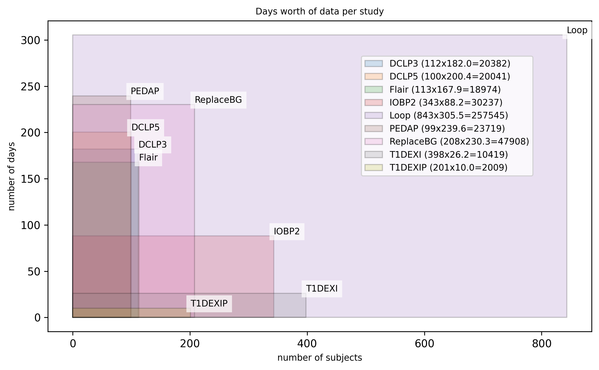
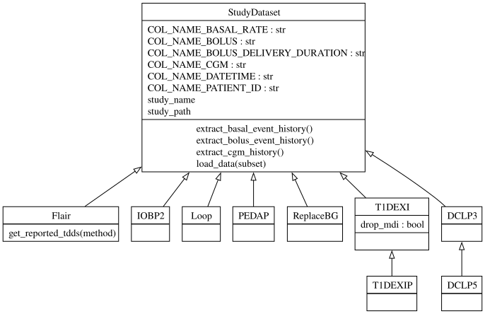

# BabelBetes

[](https://doi.org/10.5281/zenodo.20509047)
[](https://pypi.org/project/babelbetes/)

BabelBetes is the largest open-source data standardization pipeline for clinical diabetes trial datasets, currently normalizing approximately 500,000 subject-days of paired CGM and insulin pump delivery data across a variety of high quality publicly available datasets. It solves the "last mile" problem of inconsistent data formats, giving researchers and sponsors immediate access to shovel-ready data and accelerating innovation in type 1 diabetes care.

### Challenges with Publicly Available Clinical Trial Data
Data is the raw material from which models are developed, simulations are composed, and new therapies to reduce the burden of living with type 1 diabetes are developed.

Clinical trials performed at great time and expense, funded by Breakthrough T1D, HCT, and NIH have provided large volumes of granular data which is often stored publicly (www.jaeb.org) or otherwise readily accessible (OPEN Project, OpenAPS, Nightscout Data Commons).

Unfortunately this is often the only data available to researchers and developers seeking to provide innovative solutions for people with type 1 diabetes, putting them at great disadvantage relative to leading medical device companies who together gather more data per day than exists in the entire public domain, ever (approximately 500,000 subject-days).

To add to this, public available data is not stored with consistent methods or formats, resulting in a confusing array of file formats and data descriptors which must be translated at great effort and with high probability of error by each and every researcher or developer hoping to gain insights.

### Last Mile Problem
Babelbetes addresses this “last mile” problem by developing a publicly available set of tools to normalize clinical diabetes trial datasets, focusing on continuous glucose monitoring and insulin pump delivery. Babelbetes also provides recommendations on a normalized data set format to ensure future activities provide shovel-ready data for researchers and developers.

This is the [official project documentation](https://nudgebg.github.io/babelbetes)


## Supported Studies

BabelBetes currently normalizes 9 datasets covering approximately **500,000** subject-days of paired  CGM, basal, and bolus data. See the [Supported Datasets overview](./data_sets/overview.md) for the full list with sources, versions, and known issues.



## How to Contribute
BabelBetes was funded to be freely available, helping researchers and companies save costs and time, and supercharge innovation in diabetes care. 

We’re incredibly excited for contributions that will expand its functionality and support even more datasets, making a bigger impact than ever before! 

Learn more about [how to contribute](./contribute.md).

## Key Features of the Toolbox
 
 **1. Analaysis scripts and documentation**: You can learn about the datasets and what challenges came with normalizing tem by consulting the dataset summaries. You might also consult and review the jupyter notebooks that document our analysis.

 **2. Python modules**: You can use the python modules to extract standardized continuous glucose monitor (CGM) and insulin pump data from the supported study datasets. Reuse the helper and drawing functions to work with the data.
  - Extend the functionality of existing study classes or add new implementations of the StudyDataset base class to support additional study datasets. 

 **3. Recommendations**: As guidance for investigators, we've summarized our learnings and challanges in a list of recommendations that we believe would dramatically improve the quality and usability of datasets published in the future.

### Data Standardization
The ultimate purpose of this toolbox is to bring CGM, insulin, and demographic data into a common standardized format. We chose to abstract study datasets as objects. Each study class derives from the parent `StudyDataset` class and overrides methods to extract cgm, bolus, basal, and age data. The StudyDataset base class defines methods to extract all data types in standardized pandas dataframes.



#### Supported Data Types

**Bolus Data** - `extract_bolus_event_history()`:
| Column Name | Type| Description|
|----|----|----|
| `patient_id`       | `str`              | Patient ID|
| `datetime`         | `pd.Timestamp`     | Datetime of the bolus event  |
| `bolus`            | `float`            | Actual delivered bolus amount in units|
| `delivery_duration`| `pd.Timedelta`     | Duration of the bolus delivery|

**Basal Data** - `extract_basal_event_history()`:
| Column Name | Type| Description|
|----|----|----|
| `patient_id`       | `str`              | Patient ID|
| `datetime`         | `pd.Timestamp`     | Datetime of the basal rate start event  |
| `basal_rate`       | `float`            | Basal rate in units per hour|

**CGM Data** - `extract_cgm_history()`:
| Column Name | Type| Description|
|----|----|----|
| `patient_id`       | `str`              | Patient ID|
| `datetime`         | `pd.Timestamp`     | Datetime of the CGM measurement|
| `cgm`              | `float`            | CGM value in mg/dL|

**Age Data** - `extract_age_data()`:
| Column Name | Type| Description|
|----|----|----|
| `patient_id`       | `str`              | Patient ID|
| `age`              | `float`            | Patient age at study enrollment/start|

refer to the [Code Reference](reference.md/#babelbetes.studies.studydataset) for more details.

## How to use BabelBetes (Quickstart)
Here, we explain how to install the toolbox and how to use the `run_functions.py` script that batch processes all studies and extracts the standardized data.

### Setup Python
* Make sure you have python version > 3.X installed.
* We recommend using a python virtual environment (see [using vitual environments](./python-setup.md))

### Installation

#### Installation via `pip install`

This repository can be used as a dependency in other projects with pip. Install by running: 

```
pip install babelbetes
```

Example usage:

```
from babelbetes.studies import Flair
import os

current_dir = os.path.dirname(os.path.abspath(__file__))

# MODIFY SO THE PATH POINTS TO YOUR RAW DATA. THIS CAN BE EITHER THE .zip OR UNZIPPED FOLDER
study_path = os.path.join(current_dir, 'FLAIRPublicDataSet.zip')
flair = Flair(study_path)

basal_events = flair.extract_basal_event_history()
cgm = flair.extract_cgm_history()
boluses = flair.extract_bolus_event_history()
age_data = flair.extract_age_data() 

print("Basal events: ", basal_events.head())
print("CGM events: ", cgm.head())
print("Boluses: ", boluses.head())
print("Age data: ", age_data.head())
```


#### Developer

1. **Clone the repository:**
    ```sh
    git clone git@github.com:nudgebg/babelbetes.git
    ```
2. Install all dependencies
* In your terminal, navigate to the repository
* (Optional) activate your python virtual environment 
* Run this command to install all packages required by BabelBetes

```bash 
pip install -r requirements.txt
```

### Prepare the raw data
 1. Download the study data zip files from [jaeb.org](https://public.jaeb.org/datasets/diabetes) (see [supported studies](#supported-studies)).
 2. Move the files inside the `data/raw` directory. Zipped files can either be used directly or unzipped. Do not rename the file/folder names, otherwise the `run_functions.py` won't know how to process them.
 3. Depending on which studies you downloaded and whether you have .zip archives (or unzipped folders), the folder structure should look like this:
```
    babelbetes/
    ├── babelbetes/
    │   ├── studies/
    │   ├── src/
    │   └── run_functions.py
    ├── data/
    │   └── raw/
    │       ├── FLAIRPublicDataSet.zip
    │       ├── DCLP3 Public Dataset - Release 3 - 2022-08-04
    │       ├── IOBP2 RCT Public Dataset
    │       ├── T1DEXI - DATA FOR UPLOAD
    │       └── T1DEXIP - DATA FOR UPLOAD.zip
    ├── docs/
    ├── examples/
    └── tests/
```

### Run run_functions.py to batch Extract data
The `run_functions.py` script is the entry point for users that simply want to extract standardized data from the supported studies. It performs data extraction and standarization. For each folder in the `data/raw` directory the script: 
 1. Identifies the appropriate handler class (see [supported studies](#supported-studies))
 2. Loads the study data
 3. Extracts bolus, basal, CGM event histories, and age data to a standardized format (see [data standardization](#data-standardization))
 4. Saves the extracted data in CSV/Parquet format

**Command Usage:**
```bash
# Run from project root - extract all data types
python -m babelbetes.run_functions

# Extract specific data types only
python -m babelbetes.run_functions --data-types age cgm
python -m babelbetes.run_functions --data-types bolus basal

# Process specific studies only
python -m babelbetes.run_functions --studies Flair DCLP3

# Run in test mode with subset of data
python -m babelbetes.run_functions --test
``` 

Example terminal output:
``` bash
> python -m babelbetes.run_functions
[15:26:22] Looking for study folders in /data/raw and saving results to /data/out
[15:26:22] Start processing supported study folders:
[15:26:22] 'T1DEXI' using T1DEXI class
[15:26:22] 'REPLACE-BG Dataset-79f6bdc8-3c51-4736-a39f-c4c0f71d45e5' using ReplaceBG class
...
[15:26:22] Processing T1DEXI ...
[15:26:56] [x] Data loaded
[15:26:56] [x] Boluses extracted
[15:27:00] [x] Basal extracted
[15:27:12] [x] CGM extracted
[15:27:13] [x] Age data extracted
[15:27:12] T1DEXI completed in 37.43 seconds.
...
Processing complete.
```

**Extract specific data types:**
``` bash
# Extract only age data
> python -m babelbetes.run_functions --data-types age

# Extract multiple data types
> python -m babelbetes.run_functions --data-types cgm bolus age

# Extract all data types (default behavior)
> python -m babelbetes.run_functions --data-types cgm bolus basal age
```

### Execution Times
These are approximate execution times   

||MacBook Pro M3|
|----|----|
|Flair  |58 seconds|
|IOBP2  |26 seconds|
|PEDAP  |34 seconds|
|DCLP3  |15 seconds|
|DCLP5  |23 seconds|
|T1DEXI |37 seconds|
|T1DEXIP|7 seconds|
|Replace BG|30 seconds|
|Loop|151 seconds*|
|**Total**|**~383 seconds**|

\* Loop raw data files are very large which requires the use of `dask`. `dask` builds upon pandas and processes chunks of the data in parallel. However, the routine to save the data to csv - at the moment - still requires the whole dataframe to be loaded into memory before storing it which might fail if your machine has insufficient memory.


## Troubleshooting
- Ensure the raw data folders are named correctly to match the patterns in the script. You shouldn't need to rename the folders or zip archivesafter you downloaded the datasets.
- Check the console output for any warning or error messages.


## License
[](license.md)