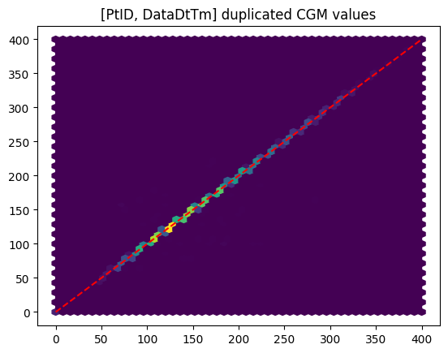
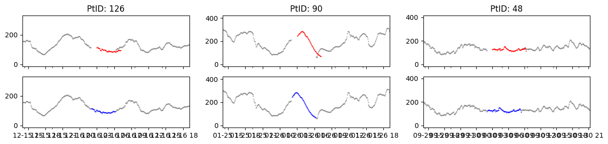
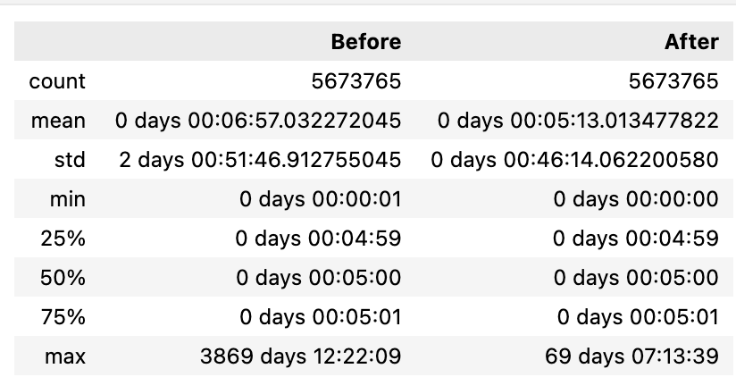
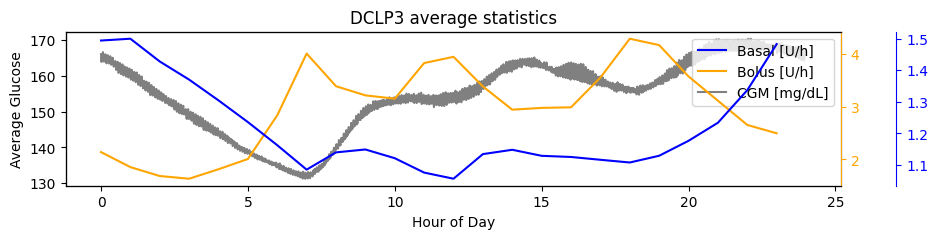
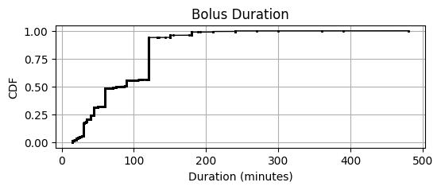

# DCLP3
This page summarizes our insights about the clinical study data of the **DCLP3** study in efforts to understand how to handle bolus, basal and cgm data as well as assumptions that were made as well as open questions. 

The full analysis of this dataset is provided in: `notebooks/understand-dclp3-dataset.ipynb`

## Study Overview
- **Study Name:** The International Diabetes Closed Loop (iDCL) trial: Clinical Acceptance of the Artificial Pancreas - A Pivotal Study of t:slim X2 with Control-IQ Technology (DCLP3)
- **Study Background:** The objective of the study is to assess efficacy and safety of a closed loop system (t:slim X2 with Control-IQ Technology) in a large randomized controlled trial.
- **Study Devices:** t:slim X2 with Control-IQ and Dexcom G6 system
- **Study Population:** Teens and adults with type 1 diabetes ages 14 and older
- **Total Data:** There are roughly 19,700 days of data from 112 participants

## Data
From the DataGlossary.rtf file, the following relevant files were identified which are stored in the **Data Tables** subfolder. These are text files ("|" separator) and host many columns related to the iLet pump events and the Dexcom CGM Data. The glossary provides information about each column. Below are the relevant columns contained in each text file.


**Pump_BolusDelivered.txt**: Holds information about pump data downloaded (bolus data only)
| Column| Description| Comment|
|--|--|--|
| PtID              | Patient ID||
| DataDtTm          | Datetime of delivered insulin ||
| BolusAmount       | The amount of bolus delivered ||
| DataDtTm_adjusted | Adjusted value of DataDtTm| when available, should be used instead of DataDtTm, see [Datetime Adjustments](#datetime)|
| BolusType         | The bolus insulin delivery type [Standard, Extended]| see [Extended Boluses](#boluses)|


**Pump_BasalRateChange.txt**: Holds information about pump data downloaded (basal data only)
| Column| Description| Comment|
|--|--|--|
| PtID| Patient ID| |
| DataDtTm| Date-time of basal rate change||
| CommandedBasalRate| Basal Rate (U/h) - The active basal insulin delivery| (see [Basal-rates](#basal-rates)|
| DataDtTm_adjusted| Adjusted value of DataDtTm| when available, should be used instead of DataDtTm, see [Datetime Adjustments](#datetime)|

**Pump_CGMGlucoseValue.txt**: Holds information about cgm data downloaded
| Column| Description| Comment|
|--|--|--|
| PtID| Patient ID| |
| DataDtTm| Date-time of cgm value| |
| CGMValue| CGM value in mg/dl| Valid readings are 40-400, anything outside this range is marked with a 0|
| DataDtTm_adjusted| Adjusted value of DataDtTm| when available, should be used instead of DataDtTm, see [Datetime Adjustments](#datetime)|

## General Observations (after manual review)
* We need to figure out how to deal with DataDtTm_adjusted
* We need to make asusmptions about extended bolus durations 
* We should analyze if an extended boluses are reported upcon delivery or completion
* We need to be aware that there will be duplicates in Record ids
* 0 CGMs need to be handled (checking previous, value >0 to decide if <40, >400) 

**Differences to PEDAP:** PEDAP and DCLP are conducated on Tandem and therefore have similar data structures. 
But some differences exist:
 - Basal rate column in PEDAP is named `BasalRate`, in DCLP3 it is `CommandedBasalRate`
 - DCLP we have two date columns `DataDtTm` and `DataDtTm_adjusted`, in PEDAP there are no adjusted datetimes
 - In `PEDAP`, extended boluses come with duration and are reported at completion. `DCLP`, we only know if a bolus is extended, but miss the duration or if the extended portion is reported at the announcement or at the completion. 
 - `DCLP` Bolus table does not come with `CarbAmount` column

## Data Integrity

### Missing Data

There are no null values except in the `DataDtTm_adjusted` columns which is expected (see [Datetime](#datetime) section). 


### Duplicate Rows
We see that 
* There are only 22 basal Duplicates and these have diffferent basal rates
* There are only 94 bolus duplicates and these all have different Bolus Types (Standard vs. Extended)
* most cgm duplicates share the same value

As the data glossary mentions, record duplicates are expected and should be ignored (data comes from multiple sources). Further, we see that the number of duplicates is almost negligible (only CGM is of interest). On inspection we see that CGM duplicates are almost identical:  



We deal with duplicates as follows:  
* Basal: Taking the maximum value (we see some zero values)
* CGM: Taking the first value
* There are no bolus duplicates when including the BolusType column. The duplicates in boluses seem to be a result of Standard and Extended Bolus portions being reported at the same time. See section on [Boluses](#boluses) on how we dealt with this.


### Incomplete Patients
We see that there are different number of unique patient ids: Basal: 125, Bolus: 125, CGM: 112. Total PtIDs with all forms of data:  112. Therefore, we reduce the data by dropping patients who miss data in one of the datafiles (13 patients).

## Datetime

### Datetime Strings
In Flair and PEDAP datetime strings were reported in inconsistent time formats: time components were missing at midnights which required special handling to improve loading performance.
After checking, we see that 
 - all datetime strings are consistent (19 charcters) indicating leading zeros. 
 - there are no missing datetimes

We can therefore move forward using the `pd.to_datetime` as is.

### Datetime Adjustments
The glossary mentions that these changes are made by JAEB. We want to make sure that we can trust these adjustment since the glossary provides little information on which data to use. In previous datasets, we already confirmed that the adjusted datetimes should be favored (when available). We got a little sceptical since some shifts were extreme (years) while others were minimal (hours, days).

We verified this by taking samples and checking how the cgm data moved as well as analyzing summary statistics on the distance between datetimes which reduced when using the `DataDtTm_adjusted` over `DataDtTm` when available.




In conclusion this confirms that using `DataDtTm_adjusted` over `DataDtTm` when available moves the data in the right spot (see blue cgm traces compared to the red ones) and reduces the variation in time differences. 


## Timestamps
We want to make sure that datetimes of all datasets are in the same datetime and provide information about local time.

The DCLP3 data glossary makes no mention of UTC, timezone or zone and all datetime variables are described as local times. We verified by checking the distribution of mean CGM, basal rates and bolus doses to verify we see postprandial peaks in the morning, afternoon and evening as well as more stable glucose during the night.



We see bolus peaks at around 7 oClock, noon and evening. Slightly delayed we see postprandial glucose peaks as expected. Bassal rates follow normal rhythm with the exception that due to Control IQ basal rates slowly degreade over night, to lower glucose after dinner as part of the closed loop control. From this we can safely assume that all datetimes are in local time. 

## CGMs

### Special Values
From the data glossary we know that 0 cgm values are either below or above range based on the `HighLowIndicator`:
>0 = CGMValue contains the glucose reading  
>1 = The glucose reading is high~ CGMValue set to 0  
>2 = The glucose reading is low~ CGMValue set to 0

We decided that replacing CGM value withe the respective measurement range boundary makes most sense for now but other ways to extrapolate, or introduce special flags could be employed later on.

```python
df_cgm.loc[i_zero, 'cgm'] = df_cgm.HighLowIndicator.loc[i_zero].replace({ 2: 40, 1: 400 })
```

## Boluses

### Requested vs. Delivered
The timestamps represent the time of delivery, which, for the extended bolues means the completion of delivery. This is not well documented and only inferred from other datasets (see below).


### Extended Bolus Duration

As in PEDAP, the `BolusType` in the bolus rows is either Standard or Extended to insulin that is delivered immedidately or over a extended duration. However, in comparison to PEDAP, there is no information about the delivery duration for extended boluses. From *JAEB* we know that the `Extended Bolus Duration` variable, present in PEDAP is **not shared by Tandem** for the DCLP3/5 datasets. Therefoe we need to make an assumption about the duration. 

In PEDAP, while the duration was explicitly provided, the timestamps of extended bolus rows was not the delivery start but the end of delivery. We can therefore **reconstruct the delivery start and duration** by matching pairs of standard and extended boluses and taking the  the standard bolus datetime as delivery start and the duration between timestamps as the delivery duration.

However, with our approach we won't be able to separate dual wave boluses (standard followed by an extended part) from *orphan* extended boluses (without standard part): Orphan Extended boluses will therefore be incorretly matched to the previus standard bolus. However, this will happen only to a small percentage (In PEDAP only ~2% (170 out of 6460)) extended boluses did not have a standard bolus part. The T-Slim X2 allows durations >=8 hours, therefore pairs matched with durations >8 hours are definitely wrong.

In **sumamry** we treat extended boluses as follows:  
1. Assume that extended boluses are reported upon completion (as in PEDAP)
2. Match standard and extended rows using a matching algorithm
3. Set extended bolus delivery start to standard bolus datetime
4. Set bolus delivery duration to:
   - For standard boluses: set to 0
   - Extended boluses: time difference between extended and standard datetimes
5. For delivery durations >8h (those are definitely matched incorrectly) set the duration to 55 minutes (median value of identified durations) 

Comparing the CDFs we see that, while different, PEDPA and DCLP3 show similar trends (60 minute and 120 minutes being the most common choices) which supports that our corrections, while not free from it, reduces error:

| PEDAP | DCLP3 |
|-|-|
| | |


## Basal Rates

In PEDAP, we confirmed that basal rate change events are reported whenever basal delivery changes, not only if the new basal rate deviates from standard basal rate. Here, we apply the same logic and assume all basal rate changes are present.
