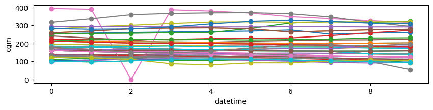
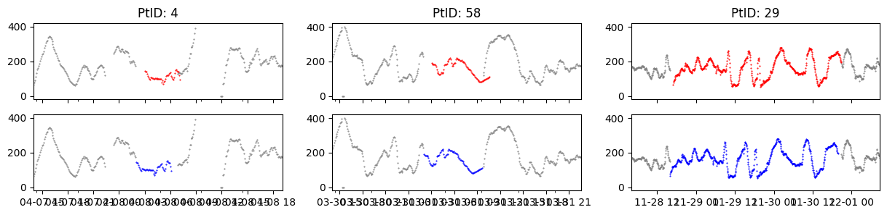
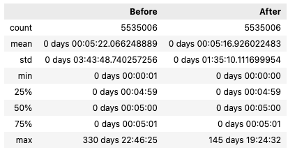
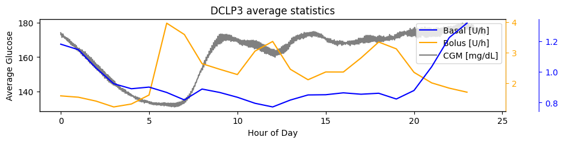
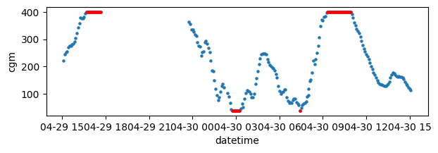
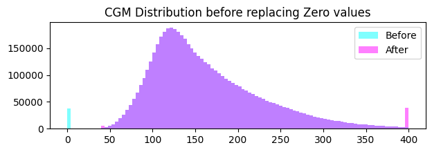
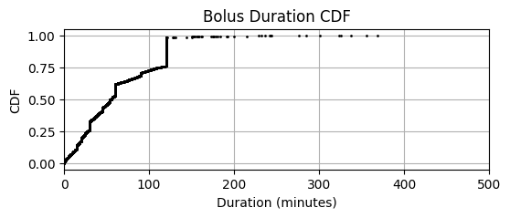
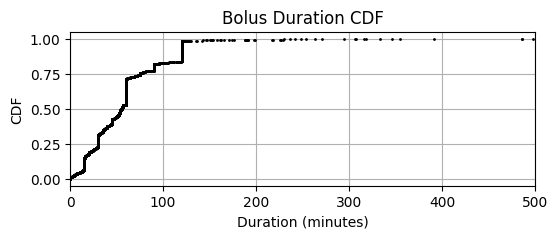

# DCLP5 
This page summarizes our insights about the clinical study data of the **DCLP5** study in efforts to understand how to handle bolus, basal, and cgm data, list assumptions that were made, and provide open questions. 

The full analysis of this dataset is provided in: `notebooks/understand-dclp5-dataset.ipynb`

## Study Overview
- **Study Name:** The International Diabetes Closed Loop (iDCL) trial: Clinical Acceptance of the Artificial Pancreas in Pediatrics - A Pivotal Study of t:slim X2 with Control-IQ Technology
- **Study Background:** The objective of the study was to assess efficacy and safety of a closed loop control (CLC) system (t:slim X2 with Control-IQ Technology) in a randomized controlled trial with partial crossover.
- **Study Devices:** t:slim X2 with Control-IQ and Dexcom G6 system
- **Study Population:** Children aged 6 - 13 years old with type 1 diabetes
- **Total Data:** There are roughly 19,200 days of data from 100 participants
## Data
The study data folder is named **DCLP5_Dataset_2022-01-20-5e0f3b16-c890-4ace-9e3b-531f3687cf53**

While there is a data glossary (DataGlossary_Dits.rtf) file, the file names within the glossary do not match the file names of the data. However, the column names do match and those definitions are listed below.

These are csv files ("|" separator) and host many columns related to the Tandem pump events and the Dexcom cgm. The glossary provides information about each column. Each file contains a limited amount of columns compared to the FLAIR data. 

### Bolus
* **DCLP5TandemBolus_Completed_Combined_b.txt**: List of pupm data downloaded (bolus data only)

| Column            | Description                                      | Comment                              |
|-------------------|--------------------------------------------------|--------------------------------------|
| PtID              | Patient ID                                       |                                      |
| DataDtTm          | Date-time of delivered insulin                   |                                      |
| BolusAmount       | The amount of insulin actually delivered for this bolus | In Glossary this is called InsulinDelivered |
| BolusType         | The bolus insulin delivery type [Standard, Extended] |                                      |
| DataDtTm_adjusted | adjusted Date-time                                | Not mentioned in glossary            |

### Basal
* **DCLP5TandemBASALRATECHG_b.txt**: List of pump data dowloaded (basal data only)  

| Column              | Description                                      | Comment                    |
|---------------------|--------------------------------------------------|----------------------------|
| PtID                | Patient ID                                       |                            |
| DataDtTm            | Date-time of basal rate change                   |                            |
| CommandedBasalRate  | Basal Rate (U/h) - The active basal insulin delivery rate in units per hour |                            |
| DataDtTm_adjusted   | adjusted Date-time                               | Not mentioned in glossary  |

### CGM
There are three CGM files mentioned in the glossary:  
 - DCLP5DexcomClarityCGM (actual name **DexcomClarityCGM**.txt): CGM readings from Dexcom Clarity (G5) files -- Final table with duplicates removed
 - DCLP5OtherCGM (actual name: **OtherCGM.txt**): List of CGM readings from CGM file types for which loading processes have not been set up (e.g. Tandem CGM hourly report, or CGM tab from Diasend file saved as csv, etc)
 - Pump_CGMGlucoseValue (actual name: **DCLP5TandemCGMDATAGXB_b**): CGM glucose value recorded on the pump
 - TandemCGMDATAGXB.txt (this was not mentioned in the data glossary)
 
* **DCLP5TandemCGMDATAGXB_b.txt**: List of cgm data dowloaded 

| Column           | Description                                                                 | Comment                       |
|------------------|-----------------------------------------------------------------------------|-------------------------------|
| PtID             | Patient ID                                                                  |                               |
| DataDtTm         | Date-time                                                                   |                               |
| CGMValue         | 40-400 mg/dL. 40-400 are legitimate glucose values. 0 is used when the reading is high or low. Use of this field depends on the glucoseValueStatus field. | Same as in DCLP3              |
| HighLowIndicator | 0 = CGMValue contains the glucose reading. 1 = The glucose reading is high (CGMValue set to 0). 2 = The glucose reading is low (CGMValue set to 0). |                               |
| DataDtTm_adjusted| Adjusted Date-time                                                          |                               |

### Observations
* Very confusing differences between Glossary and actual filenames and column names.
 * e.g. there are 4 CGM Files
 * The glossary file names don't match the actual file names
 * The glossary column names are named differently; some are missing
* Overall structure as in DCLP3, but different file names
 
## DCLP5 vs. 3 (Datafiles)
This is an overview of file names and glossary discreptancies within and between DCLP3 and 5. Test that ~~crossed through~~ are names were incorrect.
|| DCLP3| DCLP5|
| - | - | - |
| Clarity | **DexcomClarityCGM** M readings from Dexcom Clarity files| **DCLP5DexcomClarityCGM** CGM readings from Dexcom Clarity (G5) files -- Final table with duplicates removed|
| Other   | **OtherCGM** List of CGM readings from other miscellaneous sources  **cgm** aggregation of CGM data from multiple sources within the study that was used for the analyses presented in the primary manuscript  **DiasendCGM** Readings from CGM tab of Diasend file | **DCLP5OtherCGM** List of CGM readings from CGM file types for which loading processes have not been set up (e.g. Tandem CGM hourly report, or CGM tab from Diasend file saved as csv, etc)|
| Pump| **Pump_CGMGlucoseValue** One record per CGM glucose value recorded on the pump | ~~Pump_CGMGlucoseValue~~ **DCLP5TandemCGMDATAGXB_b.txt**  CGM glucose value recorded on the pump|
|**Conclusion**| We used this one: **Pump_CGMGlucoseValue.txt**| None of the files exists in reality. These are the files in the data table folder:  **DCLP5TandemCGMDATAGXB_b.txt** (we used this one) TandemCGMDATAGXB.txt DexcomClarityCGM.txt OtherCGM.txt |

Basal:

|| DCLP3| DCLP5|
| - | - | - |
| File| Pump_BasalRateChange.txt | ~~Pump_BasalRateChange.txt~~ **DCLP5TandemBASALRATECHG_b.txt** |
| Column| ~~BasalRate~~ CommandedBasalRate | CommandedBasalRate|
| Adj. Date | DataDtTm_adjusted| DataDtTm_adjusted (Not Mentioned)|

Bolus:

|| DCLP3| DCLP5|
| - | - | - |
| File       | Pump_BolusDelivered.txt          | ~~Pump_BolusDelivered~~ DCLP5TandemBolus_Completed_Combined_b.txt |
| Insulin    | BolusType                        | ~~InsulinDelivered~~ BolusType                                       |
| Type       | ~~InsulinDelivered~~ BolusAmount | BolusAmount                                                          |
| Date       | DataDtTm                         | DataDtTm                                                             |
| Adj.  Date | DataDtTm_adjusted                | DataDtTm_adjusted (not mentioned)                                    |

## Data Integrity

### Duplicates & Missing Data
* No NaN values, except the adjusted datetimes (expected)
* There are no complete row duplicates (e.g. also considering record id)

When only checking for PtID, DataDtTm, and DataDtTm_adjusted:  

 * 4290 basal rates reported at the same time (but most of them are equal)
 * 3262 cgm duplicates (but most share the same value)
 * 124 bolus duplicates (but all have different bolus types) (extended, normal) --> no real duplicates

We deal with duplicates as follows:  

* Basal: Taking the maximum value (we see some zero values)
* CGM: Taking the first value
* Bolus, we handle later in the Extended Bolus section

### Incomplete Patients
There is no need to filter patient data as all patients have complete data. 

## Datetimes
In Flair and PEDAP datetime strings were reported in inconsistent time formats: time components were missing at midnights which required special handling.

We see that:
 - there are no missing datetimes
 - As in Flair, datetimes sometimes miss the time component, even if it is only a few instances
 - The date formats are different from DCLP3 and PEDAP 
  - DCLP3: `%Y-%m-%d %H:%M:%S`
  - DCLP5/PEDAP: `%-m/%-d/%Y %I:%M:%S %p`
 
We therefore again check if the missing time components align with midnight by checking a few examples: What we see is that the 5th value (which is the one with the missing time component) snuggly fits the series. Therefore, we can safely assume it is in fact the midnight value. The drops to zero are just because because they are out of range. 

For performance purposes we use the `parse_flair_dates()` function to parse the datetimes.

### Datetime Adjustments
Again, we test if using the adjusted datetimes, if available, is appropriate. In the other datasets this was always true but we checked again to make sure. We see see that using the adjusted datetimes moves the cgm data in the right spot (mostly) and reduces the variation in time differences. DCLP5 cgm with missing time component treated as midnight fits into overall data

## Timestamps

### Time Localization
The DCLP3 data glossary makes no mention of UTC, timezone ,or zone. All datetime variables are described as local times. We want to verify by checking the distribution of mean CGM, basal rates, and bolus doses to verify we see postprandial peaks in the morning, afternoon, and evening as well as more stable glucose during the night.

We see bolus peaks at around 7am, noon, and evening. Slightly delayed, we see postprandial glucose peaks as expected. Due to Control IQ, basal increases significantly after dinner then slowly decreases overnight. This all makes sense and we can safely assume that all datetimes are in local time. 

## CGM

## CGM data

### Replace Zero CGMs
From the data glossary we know that 0 cgm values are either below or above range. 
>0 =CGMValue contains the glucose reading  
>1 =The glucose reading is high~ CGMValue set to 0  
>2 =The glucose reading is low~ CGMValue set to 0

### Special Values
    - Identify and replace any special CGM values if needed.

## Boluses

There are no bolus duplicates when including the BolusType column. The duplicates in boluses seem to be a result of Standard and Extended Bolus portions being reported at the same time. Is this true for all extedned boluses? Let's check.

There are 3169 extended boluses (~1.4% of the boluses). We apply the same logic as in DCLP3 for matching standard and extended boluses.

We found 3136 periods for 3169 extended boluses
Mean (STD) [MEDIAN] of extended boluses: 63.72 (49.83), [55.47] minutes

In comparison **DCLP3**: Mean (STD) [MEDIAN] of extended boluses: 59.02 (46.28), [55.42] minutes  

As in DCLP3, **We won't be able to clearly separate dual wave boluses (standard followed by an extended part) from *orphan* extended boluses** (without standard part): Orphan Extended boluses will be incorretly matched to the previus standard bolus.However, this will happen only to a small percentage (In PEDAP only ~2% (170 out of 6460)) extended boluses did not have a standard bolus part. The T-Slim X2 allows durations <=8 hours, therefore pairs matched with durations >8 hours are definitely wrong.

Moving forward, we will 
1. assume that extended boluses are reported upon completion (as in PEDAP)
2. Estimate delivery_duration: 
  - Standard boluses: set to 0
  - Extended boluses: time difference to their matched standard boluses
  - Durations >8h (those are definitely matched incorrectly) will be set to 55 minutes (median value) 
## Basal Rates
In PEDAP, we confirmed that basal rate change events are reported whenever basal delivery changes, not only if the new basal rate deviates from standard basal rate. Here, we apply the same logic and assume all basal rate changes are present.

### Suspends
There are no suspend events which we know of that need to be considered.

### Temporary Basals
There are no temporary basal rates that we know of that would need to be considered.
