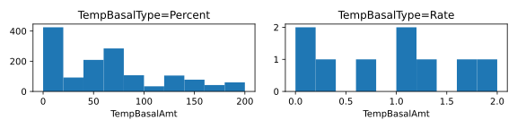
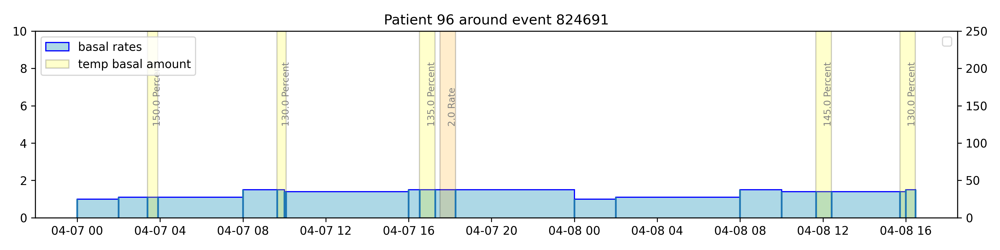
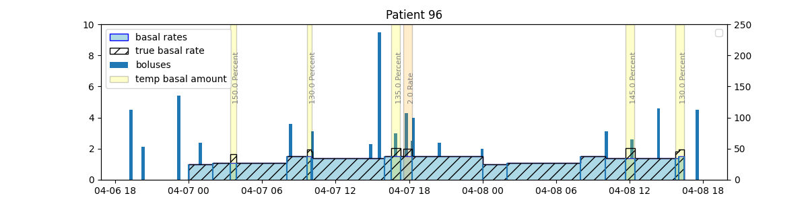
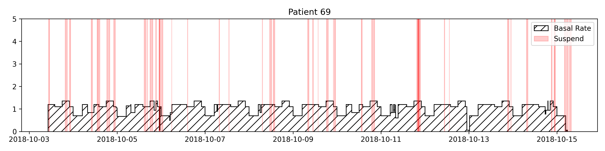
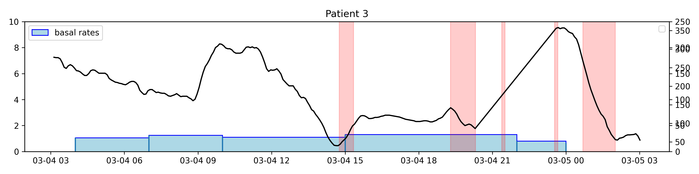
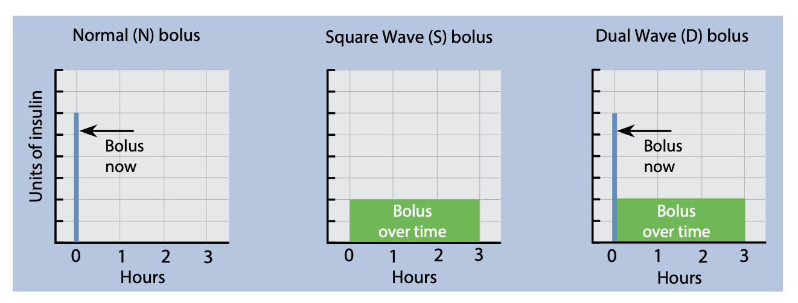
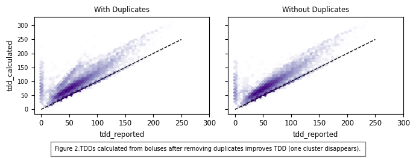
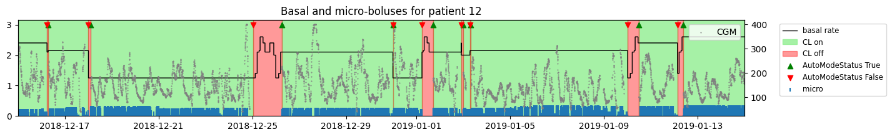
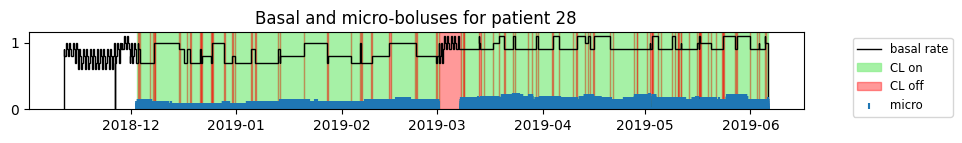
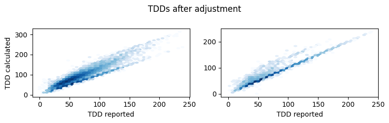

# The FLAIR study dataset

## Background information
**Study Title**: A Crossover Study Comparing Two Automated Insulin Delivery System
Algorithms (PID vs. PID + Fuzzy Logic) in Individuals with Type 1
Diabetes (FLAIR- Fuzzy Logic Automated Insulin Regulation)

**Description**: A randomized crossover trial will compare the efficacy and safety of an
automated insulin delivery (AID) system with a proportional-integral-
derivative (PID) algorithm versus an automatic insulin delivery (AID) system
with a PID algorithm enhanced with a Fuzzy Logic algorithm.
    
**Devices**: The Minimed 670G 4.0 Advanced Hybrid Closed-Loop (AHCL) (PID +
Fuzzy Logic) pump with the Guardian Sensor (3) continuous glucose
monitoring sensor.

## Data Description
The study data folder is named **FLAIRPublicDataSet**
From the DataGlossary.rtf file, the following relevant files were identified which are stored in the **Data Tables** subfolder.

* **FLAIRDeviceCGM.txt**: List of CGM data downloaded
* **FLAIRDevicePump.txt**: List of pump data dowloaded 
* **PtRoster.txt**: Patient Roster

These are csv files ("|" separator) and host many columns related to the Medtronic pump events and the guardian cgm. The glossary provides information about each column. While there are many columns, the following were identified as relevant.

**FLAIRDeviceCGM**:

* **PtID**: Patient ID
* **DataDtTm**: Date-time of sensor glucose reading
* **CGM**: Sensor glucose aka CGM - mdDl or mmol/L
* **DataDtTm_adjusted**: Adjusted value of DataDtTm 

**FLAIRDevicePump**:

* **PtID**: Patient ID
* **DataDtTm**: Date-time of pump data
* **NewDeviceDtTm**: The new date and time if this was changed in the device
* **BolusType**: Bolus type - The bolus insulin delivery type [Normal, Square, Dual (normal part), or Dual (square part)]
* **BolusDeliv**: Bolus volume delivered (U) - The number of insulin units actually delivered during the bolus insulin delivery
* **ExtendBolusDuration**: Duration of the square portion of either a square bolus or a dual wave bolus
* **BasalRt**: Basal Rate (U/h) - The active basal insulin delivery rate in units per hour
* **BasalRtUnKnown**: Basal rate unknown as marked in the carelink file
* **TempBasalAmt**: Temp basal amount - If a temp basal was applied on the pump, this value is the temp basal amount
* **TempBasalType**: Temp basal type - The type of temporary basal adjustment (insulin rate or percent of basal)
* **TempBasalDur**: Temp basal duration (h:mm:ss) - The length of time for the temporary basal insulin delivery
* **Suspend**: State "Suspend" when the pump is suspended and "Resumed" when the pump is resumed 


**Leading Questions**: 
* There are many adjusted datetime events `DataDtTm_adjusted` for CGM (none for Insulin). We need to understand how to factor them in.
* How often do `NewDeviceDtTm` events happen and do we need to account fo these or is DataDtTm sufficient?
* How often do `BasalRtUnKnown` events happen and how should we handle these?
* Are `TempBasalAmt` reflected in the BasalRt? Is the value a rate (U/h) or depend on the `TempBasalType` (Percent/Rate)?
* Do we have to keep track of temporary basal durations events (`TempBasalDur`) or do we get a normal basal rate at the end of the basal rate?
* How do we know if the temp basal rate is ended earlier than programmed
* How often does the pump suspend (`Suspend`)? Should we stop counting basal rates in this time?
* Do suspend events stop bolus deliveries? Do we need to account for it?

## Analysis of the Data
The study data was analyzed to understand which data is relevant, how it must be manipulated and interpreted in order to obtain the true delivered insulin amounts. The results are mostly based on the analysis in the jupyter notebook `understand-flair-dataset.ipynb`. Later, a second notebook was added: `understand-flair-dataset/2024-08-12 - Modularize-Flair.ipynb` that added details to TDDs and closed loop modes focusing on improving the match between reported and calcualted TDDs.

## Datetimes
* **Date time strings**: From manual inspection we know that are date time strings without time component. We treat those without as midnight (00AM). If we don't do this in two steps, the loading is extremely slow because python needs to dynamically adjust the formatter. 
* **Adjusted CGM times:** From the analysis we know that `DataDtTm_adjusted` must be used, when it exists.

Unknowns:  
* **Device time changes**: 684 `NewDeviceDtTm` instances. Unclear if these are reflected. These should be clarified!.

## Basal Rates
### Temp Basal Rates (Background)
Medtronic allows setting temp basal percentages from 0 (shut off) to 200% (twice the basal rate)

* **Temp Basal:** We have 1446 temp basal values (only 9 of these are set by insulin rate, the others are in percent). These need to be factored in.

**Temp basal rates:** "The duration of the temp basal rate can range from 30 minutes to 24 hours. After the temp basal rate delivery is completed or canceled, the programmed basal pattern resumes. The temp basal rates and preset temp basal rates can be defined using either a **percentage** of the current basal pattern or by setting a *specific rate*, as described [...]"

**Percent:** "Percent delivers a percentage of the basal rates programmed in the active basal pattern for the duration of the temp basal rate. The temp basal amount is rounded down to the next 0.025 units if the basal rate is set at less than 1 unit per hour, or to the next 0.05 units if the basal rate is set at more than 1 unit per hour. Temp basal rates can be set to deliver from *0% to 200%* of the scheduled basal rate. The *percentage used is based on the largest basal rate scheduled during the temp basal rate duration** and is **limited by the Max basal rate*."

**Rate**: "delivers a fixed basal insulin rate in *units per hour* for the duration of the temp basal rate. The amount set is *limited by the Max basal rate*"

[1] MiniMed-780G-system-user-guide-with-Guardian-4-sensor.pdf
[2] user_guide_minimed_670g_pump-skompresowany.pdf


> Description: Histogram of temporary basal rates reported in the flair data.

### Processing Temp Basal Rates
* We have no unknown basal rates, therefore this column can be ignored
* Basal rates are reported every time they change
* Standard basal rates do not reflect temporary basal rate changes
* Temporary basal rates are either given in percent [%] of the normal basal (TempBasalType=='Percent') or as a delivery rate [U/h]  replacing standard basal (TempBasalType=='Rate') 
* During temp basal rates are active, Standard BasalRt events can change and are reported


>**Description**: The figure above shows that temporary basal rates are not reflected in the reported basal rates.

**Percent**:
* Standard Basal rates are reported shortly after temp basal start and stop
* Temporary Basal Percent rates are reported **twice**, with the same timestamp but the duration format differs with leading 0 or without leading zeros for the hour (e.g. 00:15:00) vs.(0:15:00) 
* Interpreting Temp Basal of 100 Percent:The manual notices that *The percentage used is based on the largest basal rate scheduled during the temp basal rate duration*. So a value of 100% would change the basal rate to the highest standard basal rate, even if it occurs occurs within the duration of the temp basal rate. (*Assumption*)

**Rate:**
* There are only 9 cases where temporary basal is "Rate", in these cases, standard basal rate is **not** reported shortly after the temp basal rate *starts*
* Temporary Basal Percent rates are reported **once**, without leading 0 for duration hour (0:15:00) 

**Takeaway:** 
To reconstruct true basal rates, we need to consider the TempBasalAmt and TempBasalType. We can use the BasalRt events as a basis and apply the TempBasalAmt for the duration of the TempBasalDur. Depending on the value of the TempBasalType, we either need to multiply the BasalRt by the TempBasalAmt (when TempBasalType is "Percent") or we can directly set the BasalRt to the TempBasalAmt (when TempBasalType is "rate"). 

To create the correct event history, we take advantage of the fact that basal rates are reported shortly after a Percent rate is set. Here, we simply multiply all basal rates within the temp basal duration period. After the temp basal duration, the standard basal rate is reported and automatically takes over. In the "Rate" case, we know that the standard basal rate is not reported shortly after the temp basal starts, so we need to treat the event as a new basal rate by copying the temp basal amount. While the temp basal Rate is set, standard basal rate changes should be ignored, we do this by setting all basal rates within the active duration to NaN (not 0!). As before, we take advantage of the fact that after the temp basal stops, a standard basal event is reported and automtaically takes over. 


>**Description**: The figure above shows the result of applying the method described in the previous section to reconstruct the true basal rates. 


### Pump Suspends
**Suspend:** There are 72424 suspend events. These need to be factored in.


* **End suspend without start:**  The very small difference is likely due to glucose suspend events that were started before the observation period. But this makes matching a little *more difficult*. We want to make sure we match the right pairs!
* **Most users start with NORMAL_PUMPING:** For the majority of users we get a NORMAL_PUMPING event as the first Suspend event without a previous Suspend event. This could be because a) the pump was being set-up (e.g. catridge change etc.) and reported normal operation (to be verified) or b) there was a suspend event before the data collection started (unlikely because suspends are often short). 
* **First Resume event**: For those users whose first suspend event is a resume to normal pumping event, we don't know how long before the pump was suspended. The average time between the first insulin event and this resume event is roughly 0.25 hours. However, the maximum time is >10 hours.
* **Not reflected in Basal**: Suspend events are not reflected in the reported basal or temporary basal rates. 
* **Basal rates** are *not* reported before/after a suspend event starts/stops




## SmartGuard
**670g manual:**
>SmartGuard suspend (Suspend before low and Suspend on low) features. SmartGuard suspend features can automatically stop and resume insulin delivery based on your SG values and low limit.
>When a SmartGuard suspend event occurs, basal insulin delivery automatically resumes if your SG values are rising and have met the specified criteria,

From this it is unclear wether boluses are also cancelled or just basal.

**Medtronic FAQ:**
>I bolused for food I did not eat, will the system stop insulin delivery?
>If the system sees that the sensor glucose is falling it will decrease the insulin being delivered and/or stop insulin from being delivered. However, it is important that you eat the amount of carbohydrates that you bolused for because the bolus insulin that you gave will already be working in your body.
This indicates that boluses will in fact be stopped

>Can you deliver a Dual Wave™ or Square Wave™ bolus in SmartGuard™ technology?
>You cannot deliver a dual or square wave bolus in SmartGuard™ technology. The system is designed to compensate for a delayed rise in sensor glucose levels due to high fat, high carb meals. The auto basal adjustments every 5 minutes and auto corrections may eliminate the need for using the dual or squave wave bolus.
So it might not even be relevant for us. Question remains what happens during a suspend while a standard bolus is ongoing.

**User Blog Post**
https://littlet1d.blogspot.com/2015/03/smartguard-dual-wave-bolus-cancellation.html
>In this article from 2015 a user complains:
The message in the data file (not the pump screen) is the same as before:-
Suspend Before / At Low will suspend basal and cancel an extended bolus. 
>
>The answer for us is the same: We need to manually go back in after basal has resumed and put in a revised Square Wave bolus if necessary.
>
>Ok, I get it, but I’m still concerned: We know and understand that we need to think about manually inputting a revised Square Wave bolus following a Suspend before Low.
>
>But - and this is, I think a big “but”, there’s no obvious warning / reminder message on Resume to prompt you (or whoever happens to be looking after Janki) to do this. There is an alarm in the pump log, but it doesn’t make it to the screen...
:arrow_right: At least in 2015 boluses seem to be cancelled and not resumed automatically, only basal resumes.```

### What we learned about SmartGuard
* Extended bolus are not possible during closed loop mode
* pump suspsends stop basal rates
* The analysis shows that boluses during closed loop mode are often reduced, this is likely a result of the smartguard feature (parital cancellation). So we trust the reported boluses as is. * One way to check this would be to identify boluses that overlap with a suspend event.

**Unknows**:  
 * It is yet not 100% if the reported "delivered" boluses already account for suspends (we assume the reported delivered amounts are correct)

## Boluses
* **Normal bolus**: provides a single immediate dose of insulin.
* **Square Wave bolus**: delivers a single bolus evenly over an extended period of time from 30 minutes up to 8 hours.
* **Dual Wave bolus**: delivers a combination of an immediate normal bo‐ lus followed by a Square Wave bolus.


>**Description**: Bolus types explained from the Medtronic Manual.

### What we learned about Boluses
* There are (697 or 534) dual wave and 46 sqaure (extended) boluses (<0.02% of the boluses). The dual wave bolus events (square part) (normal part) should be equal in theory. But this could be because some boluses were stopped (working assumption).
* There are very little extended boluses because these are not allowed during closed loop mode
* For dual wave boluses, the number of normal an square events don't match up. We **assume** that these boluses were stopped early. This could be further verified by checking if the number of missing events matches the amount of boluses for which the deliverd amount < the selected (were stopped early).
* When a bolus is stopped early, the shorter duration appears to be automatically reflected in the reported duration. (data based assumption)
* We need to use the delivered over the selected bolus

**Unknowns**:  

* It remains unclear if pump suspend events impact the boluses, this should be clarified with the investigator or manufacturer


### Bolus Duplicates
Overall, we have 78088 duplicated bolus rows which makes 2.20% of all boluses. After the removing these, the reported and calculated TDDs move closer together. The tricky part here was that the bolus source names were different: For example some duplciated micro boluses use CLOSED_LOOP_MICRO_BOLUS while the other row uses CL_MICRO_BOLUS. Therefore, the bolus source is not used to find duplicates, only the datetime and bolus amount. After remving the duplciates, the calcualted and reported TDDs matched better:



## Closed Loop Mode
When closed loop mode is on , basal rates are replaced by micro-boluses.  To prevent incorrect forward filling of basal rates, closed loop modes must be respected. 


Initially we set all basal rates to zero that occur during closed loop start (AutoModeStatus==True) and stop (AutoModeStatus==False) event. However, when patients transition from the 670G to the AHCL algorithm, the reported AutoModeStatus can be incorrect (e.g. auto mode on but no micro boluses) and correct basal rates would be ignored.


By only setting the basal rate to zero when a AutoModeStatus true event occurs solves this problem: 
1. Basal rates are not forward filled with previous basal rates (e.g. also when suspend events occur)
2. When basal rates are reported again, we trust them.




## TDDs 
Reported TDDs are used to test our calcualted basals and boluses. This is an excellent way to validate our approach. Other datasets don't report TDD which leaves the developer in doubt if their assumptions how to process boluses and basals are valid. Some of our initial assumptions were wrong or incomplete and TDD allowed us to fix these. In fact, some data (such as the suspends) were overlooked initially and poor TDD fits helped us locate these problems.

However, reported TDDs also seem to be partially corrupt. Our analysis shows that often, multiple TDDs reported on a single day including zero values. On these days, the reported and calculated TDDs don't match at all and taking the sum or the last or maxium value still results in a poor fit. Therefore, we can't trust that reported TDDs are 100% accurate, especially on days where multiple values are reported. For testing, days with multiple TDDs should not be trusted.

## Unknowns/Open Questions
 * How to handle device time changes
 * Unclear if a suspend also cancels an ongoing bolus and if this is already reflected in the data.
 * Remains unclear why some TDDs are split and show a poor fit. This also impacts trust in other reported TDDs.

