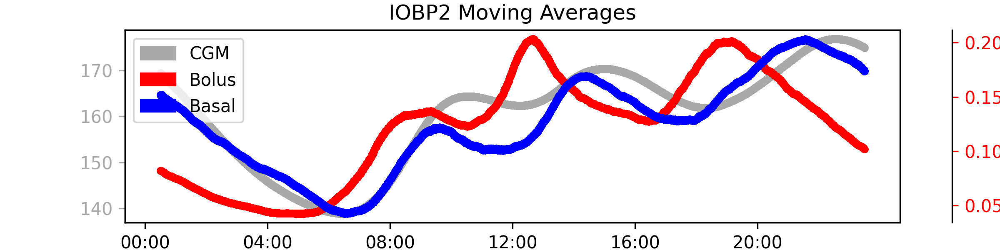

# IOBP2 
This page summarizes our insights about the clinical study data of the **IOBP2** study in efforts to understand how to handle bolus, basal and cgm data, list assumptions that were made, and pose open questions. 

The full analysis of this dataset is provided in: `notebooks/understand-iobp2-dataset.ipynb`

## Study Overview
- **Study Name**: The Insulin-Only Bionic Pancreas Pivotal Trial (IOBP2)
- **Study Background:** This was a multi-center randomized control trial to compare the efficacy and safety of the iLet Bionic Pancreas (BP) system. Enrolled participants used the devices and collected data over a 13 week period.
- **Study Devices:** Insulin data is recorded from the iLet BP. Data is stored as Basal Insulin Delivery, Bolus Insulin Delivery, and Meal Insulin Delivery. 
CGM data is recorded from Dexcom G6 sensors. 
- **Study Population:** Children and adults with type 1 diabetes ages 6+
- **Total Data:** There are roughly 30,000 days of data from 343 participants

### Data
From the DataGlossary.rtf file, the following relevant files were identified which are stored in the **Data Tables** subfolder.

* **IOBP2DeviceiLet.txt**: All events logged on the iLet including CGM and insulin delivery 
* **PtRoster.txt**: Patient Roster
* **IOBP2Insulin.txt** contains information about the patient's insulin.
* **IOBP2ManualInsulinInj.txt** should hold manual injections but it is unclear if these only relate to MDI patients or in general and if these also contain the basal injections.

Note:  It appears that some MDI patients continued administering basal insulin. It is unclear if these are contained in the manual injections table.

These are text files ("|" separator) and host many columns related to the iLet pump events and the Dexcom CGM Data. The glossary provides information about each column. Below are the relevant columns contained in IOBP2DeviceiLet.txt.

### Relevant Columns

- **PtID**: Patient ID
- **DeviceDtTm**: Local date and time on the device
- **CGMVal**: CGM glucose value. Valid CGM values range from 39-401 mg/dl.
- **BasalDelivPrev**: Delivered basal dose (U) of the prior executed step 
- **BolusDelivPrev**: Delivered bolus dose (U) of the prior executed step 
- **MealBolusDelivPrev**: Delivered meal bolus dose (U) of the prior executed step 

## CGM
### CGM Magic Numbers
Less than 1% of the cgm values are 39 or 401 which mark beloa and above range values which are replaced by 40 and 400 as we've done in other datasets before.

## Duplicates
There are very few duplicates and the second record (that with the higher record index) in most cases is a NaN CGM value and 0 insulin. These look corrupted and should be dropped. The remaining number is only 4 rows and we apply the same logic here without further investigation.

## DateTimes
 DeviceDtTm has two formats within the data: mm/dd/yyy and mm/dd/yyyy HH:MM:SS. It is assumed that the missing time values are exactly midnight.  All DeviceDtTm values with only mm/dd/yyyy have 00:00:00 added. 

### Local Datetimes 
Datetimes are in local time and the typical diurnal pattern of postprandial spikes and over-night drop in glucose is visible which confirms that datetimes are in fact local.

## MDI patients
The iLet supports MDI patients with long acting insulin. From the study protocol:
>The iLet provides a daily readout with updated estimates of daily basal insulin (in terms of a daily long-acting insulin dose for MDI users and a 24-hour, four-segment basal rate dose for CSII users)

The insulin information is in `IOBP2Insulin.txt`. It is yet unclear if this means that patients continued administering basal doses and how these can be 

The file `IOBP2ManualInsulinInj.txt` should hold manual injections but it is unclear if these only relate to MDI patients or in general.

## Assumptions
 - It is assumed that the missing time values are exactly midnight.

## Unknowns
 - Did MDI patients continued basal injections?
 - Does the manual injections contain a full log of all additional insulin injections? 
    - Does it also contain basal? How to differentiate?