# Loop 
This page summarizes our insights about the clinical study data of the **Loop** study in efforts to understand how to handle bolus, basal, and cgm data, list assumptions that were made, and pose open questions. 

The full analysis of this dataset is provided in: `notebooks/understand-loop-dataset.ipynb`

## Study Overview
- **Study Name**: An Observational Study of Individuals with Type 1 Diabetes Using the Loop System for Automated Insulin Delivery: The Loop Observational Study (LOS)  
**Description**: Passive data collection to collect data on the efficacy, safety, usability, and quality of life/ psychosocial effects of the Loop System  
**Devices**: insulin pump and a Dexcom or Medtronic CGM  
**Study Population**: People of any age with Type 1 Diabetes

## Data
The study data folder is named **Loop study public dataset 2023-01-31**

From the DataGlossary.rtf file, the following relevant files were identified which are stored in the **Data Tables** subfolder.

| File Name                     | Description                               | Note                                                                                           |
|-------------------------------|-------------------------------------------|-----------------------------------------------------------------------------------------------|
| **LOOPDeviceBasal<i>.txt**    | i=1-3, basal data exported from Tidepool | 3 files: 2.9GB, 2.9GB, and 1.35GB                                                             |
| **LOOPDeviceCGM<i>.txt**      | i=1-6, CGM data exported from Tidepool   | 6 files: 2.14GB, 2.24GB, 2.3GB, 2.31GB, 2.33GB, and 1.53GB.  Contains more patient IDs than Basal and Bolus files |
| **LOOPDeviceBolus.txt**       | Bolus data exported from Tidepool        | 1 file: 349MB                                                                                 |
| **PtRoster.txt**              | Patient Roster                           | Contains fixed UTC offsets which we need                                                     |

### Relevant Columns:
The following lists all relevant columns. Other columns were considered irrelevant. Some are still mentioned if they serve the discussion but are crossed through.

#### LOOPDeviceCGM1-6
| Field_Name | Description | Note |
|----|----|-|
| **UTCDtTm** | Device date and time adjusted with timezone offset| These are UTC, the description is misleading! *1 |
| **RecordType**| Type of data (CGM, Calibration, etc)| Needed to drop calibrations|
| **CGMVal**| Glucose reading from the CGM (in mmol/dL from Tidepool)| Convert to convert to mg/dl|
| ~~DeviceDtTm~~| Local device date and time; note not present in most rows because unavailable in Tidepool data source | *1 |
| ~~TmZnOffset~~| Timezone offset | *1 | 
| ~~Units~~ | Glucose reading units | all CGMs are in mmol/dL| 


#### LOOPDeviceBasal1-3

| Field Name | Glossary Description| Notes |
|-|-|-|
|**PtID**| Patient ID| Was not mentioned in glossary|
| **UTCDtTm**| Date and time with timezone offset| *1|
| **Rate** | Number of units per hour| **This is likely the only relevant value here**|
| ~~DeviceDtTm~~ | ~~Local device date and time; note not present in most rows because unavailable in Tidepool data source~~ |*1|
| ~~TmZnOffset~~ | ~~Timezone offset~~ | *1 | 
| BasalType| Basal delivery type | Unclear|
| Duration | Actual number of milliseconds basal will be in effect | Unclear |
| ExpectedDuration | Expected number of milliseconds basal will be in effect | Unclear|
| Percnt | Percentage of suppressed basal that should be delivered | Unclear|
| SuprBasalType| Suppressed basal delivery type (suppressed basal = basal event not being delivered because this one is active) | Unclear, ambiguous description. JAEB did not use these values (see Q&A with JAEB below) |
| SuprDuration | Suppressed duration |Unclear|
| SuprRate | Suppressed rate | Unclear|

Example (first row):  
| PtID   | UTCDtTm| **BasalType** | Duration | ExpectedDuration | Percnt | Rate  | **SuprBasalType** | SuprDuration | SuprRate | TmZnOffset | 
|---|---|---|---|---|---|---|---|---|---|---|
| 1082 | 2018-05-29 10:02:56| **temp**| 244000   ||| 1.475 | **scheduled**|| 1.600|| 


#### LOOPDeviceBolus
| Field_Name| Description | Note |
|-|-|-|
| **UTCDtTm**| Device date and time (with timezone offset) |*1|
| **BolusType**| Subtype of data (ex: "Normal" and "Square" are subtypes of "Bolus" type)||
| **Normal** | Number of units of normal bolus |Likely the only relevant value.|
| ~~DeviceDtTm~~ | Local device date and time; note not present in most rows because unavailable in Tidepool data source |*1|
| ~~TmZnOffset~~ | Timezone offset |*1|
| ExpectedNormal | Expected number of units of normal bolus|Unclear|
| Extended | Number of units for extended delivery | We found that there are 0.4% extended boluses, probably initiated by the user from the pump directly since Loop does not support these.|
| ExpectedExtended | Expected number of units for extended delivery|
| Duration | Time span over which the bolus was delivered (milliseconds for Tidepool data, minutes for Diasend data) | Our analysis shows that Duration refers to the Extended part of a Bolus. However, unclear how to find out wether in ms or minutes. JAEB couldn't answer.|
| ExpectedDuration | Expected time span over which the bolus should have been delivered (milliseconds for Tidepool data, minutes for Diasend data) |

We asked JAEB:

**Suppressed Deliveries:** What are suppressed deliveries in the context of basal data?    
> Answer: **We do not know** what the suppressed deliveries represent in this context, and we did not use this information for our analyses.  We calculated TDI using the Rate and Duration variables.  We suggest reaching out to Tidepool for information on suppressed deliveries.

**Patient IDs Discrepancy:** Why are there more patient IDs in the CGM files than in the Basal and Bolus files?  
> If available, CGM data from the participant’s personal CGM was collected for the 3 months prior to enrollment. A number of participants provided the retrospective personal CGM data but did not use Loop/provide us with their Loop data.

**Time Zones:** The UTCDtTm field does not include timezone information and TmZnOffset is only available when DeviceDtTm exists, which is rare. Local time might need to be extrapolated using backward / forward filling or using PtTimezoneOffset of the patient roster, which may not be reliable over long periods. How can local times be obtained for all patients, given the limited availability of DeviceDtTm and the potential inaccuracy of PtTimezoneOffset? 
>When we did the analysis, we used participant zip codes to estimate a local time. However, the zip code is not available in the public dataset. Instead, the variable PTTimezoneOffset in the PtRoster dataset can be applied to all UTC times to obtain a local time. During daylight savings, the offset should be reduced by 1.  This won’t be a perfect measure of the local time but should be a close approximation.

**Dexcom Times:** Are Dexcom DexInternalDtTm times in local time or UTC?  
> We did not use this variable because it is missing for the majority of cases.  We believe that it was only available in downloads from personal CGMs but not available in the data uploaded by Tidepool.  It may be the local time but may need to reach out to Dexcom to confirm this.

**Data Source Identification:** How can we determine if the data is uploaded from Tidepool or Diasend, especially since this affects the interpretation of extended boluses?  
> In most cases (perhaps all), Tidepool uploads are indicated by the OriginName field being equal to ‘.com.apple.HealthKit’.  However, we suggest reaching out to Tidepool as there might be scenarios where Diasend was involved in the data chain.

 - [1]:DeviceDtTm and TmZnOffset are only available for a fraction of patients. Therefore, we rely on UTCDtTm and patient roster PtTimezoneOffset to obtain local time. 
 - [2]: Loop has no extended boluses, check what this is

### Todos:  
Boluses:  
 - Need to check if the Normal portion is the actual delivered by comparing the values (<= in all cases would prove this to be true).
 - Check if there are extended boluses
 - Can we determine the delivery duration (ms or minutes) based on the data source?
Basals:
 - Need to double check if the Suppressed values are already factored in and if standard basal rates are reported as well.
 - Check potential values for columns like basal type (value-counts)

 
## General Observations
### File Sizes
- **Memory usage:** 1GB for a single CGM file is too much. The patient data is spread accross various files which requires out of memory approaches.

Processing patient data requires us to load all files into memory at once because the patient data is spread accross all CGM files. While we could use dask on the csvs directly, this would create a lot of overhead (shuffling to perform grouped conversions). 
Instead, we convert the csvs to parquet format which splits the data into patient directories. This way we can load patient data one by one and process in parallel using dask.


### Incomplete Patients
Yes, there are some patients with only CGM data but missing basal data.  The patients were excluded.

## Datetimes

### uutc vs local
We started by working with CGM data to understand how to obtain local datetimes.  Unfortunately, for most of the data only UTC time exists while DeviceDtTm (local device time) and TmznOffset (time zone offset from utc) are NaN.
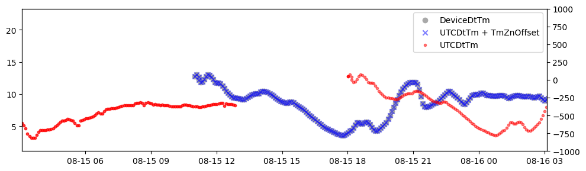
 We confirmed this relationship by plotting the diurnal distributions of glucose and boluses and found the expected postprandial peaks in the morning, around noon, and evening when using local times.

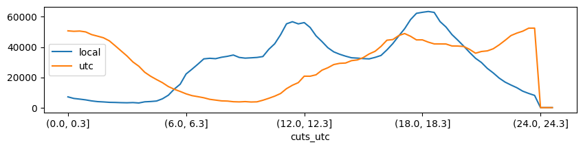

### Timezone information
However, we can **not rely** on DeviceDtTm and TmZnOffset because it only exists for a fraction of the data. Therefore we need to rely on UTCDtTm and either extrapolate TmZnOffset (using forwarnd/backward filling) or use the patient roster time zone offsets. 

One option would be to extrapolate the `TmZnOffset` (bfill/ffill)? To check if this is a viable option we checked how many patients have TmZnOffset data and found that only 37.18% of patients have at least one timezone offset.

Instead, we chose to use the `PtTimezoneOffset` (utc offset in hours) from the patient roster. To understand if using this *static* value is acceptable, we wanted to understand how often the actual timezone changes. Because we need to consider more frequent changes such as travel times, daylight saving times, etc.

We did this by using the 37% of patients with actual timezone data available:

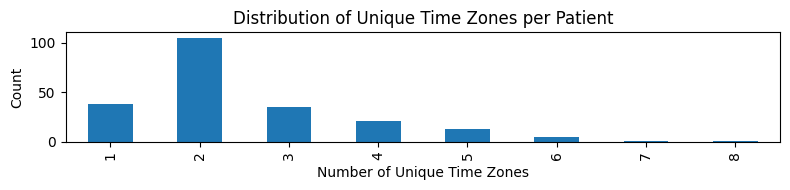
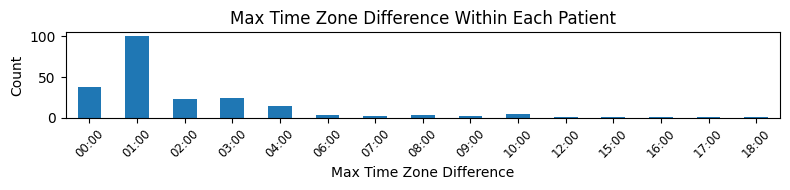

 - approx 63.0% of patients have shifts of 1 hours or less
 - approx 65.3% of patients have 2 unique time zones or less

We see that: 
 - Most patients experience more than 1 time zone. 
 - The majority is a change of 1 hour. This is likely the result of daylight saving times. 
- But, also a significant fraction experiences changes of 2,3 or 4 hours or more. 

### Estimating time zone error
However, these time zone changes are likely infrequent as most patients will travel for short periods only. We estimated the expected error by comparing the static offsets (PtTimezoneOffset) (from the patient roster) with the actual device reported offsets ((TmZnOffset) for the fraction of patients with that data). 

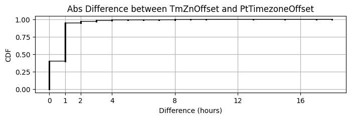

The CDF shows the distribution of the error which we can expect in the other patients. The local time error will be <2 hours for >96% of the cases.

### Datetime Conclusion
Local datetimes can be obtained with a small estimated error (<2 hours for >96% of the cases) by using the patient roster static time zone utc offsets PtTimezoneOffset and UTCDtTm utc timestamps. 

```local_time = UTCDtTm + PtTimezoneOffset```

## CGM
- Unit is mmol/dL or mg/dl
- there are also blood glucose calibrations 

### Special Values
CGM values are capped (as expected) but no special values (e.g. 0) values exist.
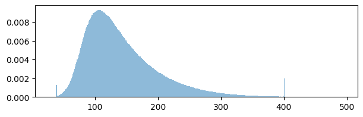

#### CGM Duplicates
 - There are no nan values
 - 38,562,037 duplicates (34.70%) (same in all columns)
 - 42,680,198 duplicates (38.41%) (when only considering 'UTCDtTm' column)
 
 We checked and found that even the 4 % CGM values that reported at the same time but with diffferent values are almost identical:
 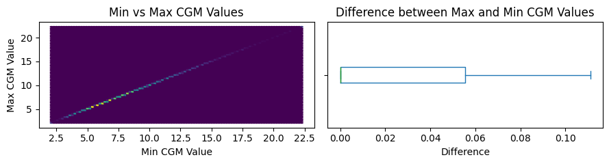

 ### CGM Conclusion
- Many duplicates that need to be dropped
 - CGM Data must be converted from mmol/dL to mg/dl
 - There are no NaN values
 - Calibrations need to be dropped
 

## Boluses
### Duplicates
There are a significant amount of duplicates; most duplicated rows are completely identical (except for the record id). 
However, we also see slightly more duplicates when only considering ['UTCDtTm', 'PtID'] columns (72891 duplicates (2.97%)). This means that there are rows that have equal  ['UTCDtTm', 'PtID'] but vary otherwise. 

We found that there are:
1. some differences in the firmware (can be dropped)
2. temporal duplicates with different bolus amounts 

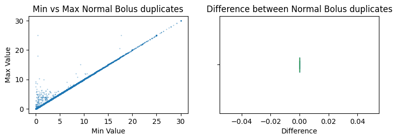

We found that sometimes boluses are drastically different. We don't know why that is and we wouldn't know which value to pick. But on average, the error seems negligible (close to zero).


### Dual wave Boluses
We know there are some dual wave and extended boluses. Since Loop does not support these natively, these were likey initiated by the user from the pump or during open loop mode.

0.43% of boluses are extended
In 100.0% of all rows, it is either extended and duration are filled or neither
#### Bolus Duration
From the glossary we know that the duration is either in ms or minutes.  However, it appears that only milliseconds are present. 

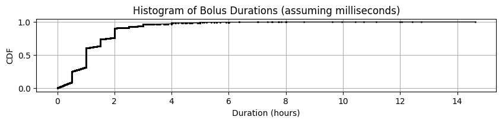

However, it does not look like the data would be split in ms and minutes (there is no skewed peak around 0). 

We know that duration values refer to the extended bolus duration. Therefore these rows need to be split in an immediate and an extended part. This is different to other datasets where we had to merge rows or subtract delivery durations to obtain delivery start and delivery durations.


#### Requested vs. Delivered
There seem to be only delivered events, no requested.

### Conclusion

* There are some duplicated (in time) Boluses ~3% 
* These boluses are mostly equal but in rare cases significantly different (reason unclear)
* Extended boluses exist and should be separted, it appears that Duration is always given in milliseconds


## Basal Rates

  - <0.1% Basal rates are percent (TODO: check if these rows miss the rate)
 - ~0.1% duplciates, which is very little
 - 25% don't have suppressed basal type, most miss duration

The glossary defines Suppressed events as follows:

>Percnt: Percentage of suppressed basal that should be delivered
>SuprBasalType: Suppressed basal delivery type (suppressed basal = basal event not being delivered because this one is active)
>SuprDuration: Suppressed duration
>SuprRate: Suppressed rate

From this it is not quite clear what they mean. 

### Duplicates
DUPLICATES:
'211166 duplicates (0.44%)'"435830 duplicates (0.90%) ['UTCDtTm', 'PtID']"

We found that these temporal duplicates differ in almost all columns. In some cases we saw that temporal duplicated rows have different durations and one row seems to have incorrect/incomplete data: very small Duration, missing type, missing rate. By keeping the maximum duration, we mostly remove the left tail. But honestly, we don't know what is going on.

### Basal Type
`BaslTypes` differ with `temp` in ~ 99.5% of the cases. Less than 0.5% are scheduled or suspend (0.038%).
The SuprBasalType colum only contains `scheduled` values (92%, while the rest is empty).

We asked JAEB about suppressed deliveries and they also didn't know how to interpret them and recommended reaching out to Tidepool directly. 

We checked and found that the relationship between the values is `Percnt = Rate / SuprRate`. Now it is unclear wether to use the SuprRate or the Rate. The glossary sounds like the Rate is the actual delivered rate. We asked JAEB and they also used the rate.

### Basal Durations
It is unclear to us whether the basal duration must be considered or if the basal rate should be kept active until the next basal rate is reported. We are unsure because we sometimes see basal rates being reported as zero while at other times, after the duration expires, no new basal rates are reported.

In the example below (Patient 13, day 2018-01-27), basal rate at 6:48 is reported with a duration of 300000 (5min) but no further rate is reported until the next reported value at 12:14. 

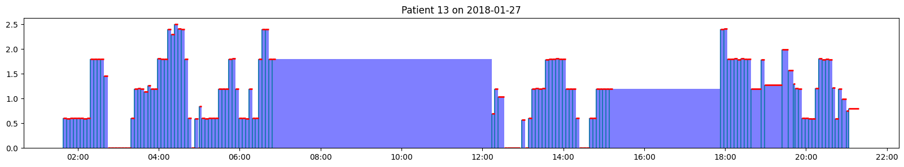
In the figure, the red markers indicate the duration.  These mostly reach from one basal rate to the next. However, in some cases, the duration is shorter.

### Basal Gaps
We are aware that there are gaps in basal rates. For example on day 2019-05-17 patient 3 basal rates only range from midnight to 10:00AM it is unlikely this is because basal rates remain unchanged. 

The general trend can be seen in the CDF plot below showing the time between the first and last reported basal rate for each day. 
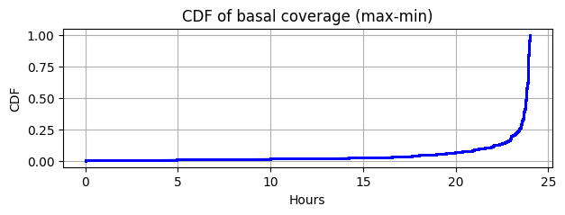

As we can see most days have good coverage but about 10% have less coverage than 20 hours. This means that many hours of basal rates need to be forward filled from basal rates from previous days.

## TDD Validation

In order to verify if we correctly extracted basal rates, we compared our calculated TDDs with those reported by JAEB (using **totalDailyInsBolus** from the gluIndices.txt with Period *Months 1-6*). 

However, what we found is that our calculated TDDs are much higher than those provided by JAEB. Understanding the differences could help us reveal unknowns and wrong assumptions that we made about the data. 

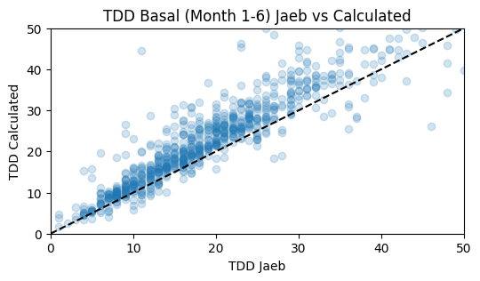

## Open questions
 - Do we need to consider basal type and suppressed values? 
 - How to treat basal durations and how to fill basal gaps?
   - Do basal rates remain active until the next event is reported?
   - Are reported basal rates the absolute basal rate or the deviation from standard basal?

 - Why do we see bolus duplicates shifted by one hour?

