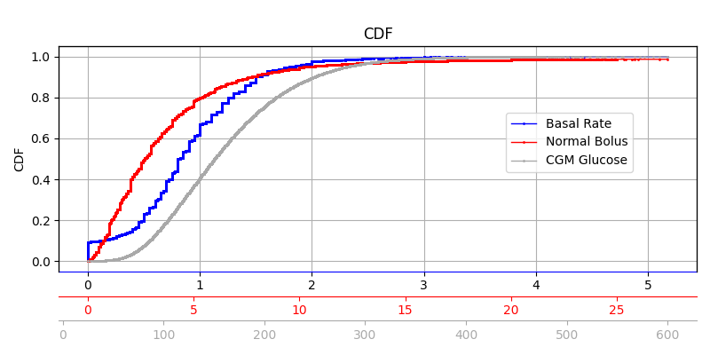

## Replace BG

A Randomized Trial Comparing Continuous Glucose Monitoring With and Without Routine Blood Glucose Monitoring in Adults with Type 1 Diabetes

**Background:** The primary objective of the study is to determine whether the routine use of CGM without BGM confirmation is as safe and effective as CGM used as an adjunct to BGM. 

**Duration**: Run-in phase of 2–10 weeks, 26 weeks study duration
**Devices:** Dexcom G4 Platinum
**Population:** 276 entered run in phase, 226 were assigned to groups, 217 completed, Patients, Type 1, >=18 years, CSII
**Data:** There are roughly xxx days of data from 225 participants  


“Data were uploaded from the study CGM and BGM devices and the participant’spersonal insulin pump by using the Tidepool platform (http://tidepool.org). For insulin pumps that were unable to be uploaded to the Tidepool platform, the data were obtained by using Diasend (Chicago, IL) software” ([Aleppo et al., 2017, p. 540](zotero://select/library/items/JMBWSKEE)) ([pdf](zotero://open-pdf/library/items/JHYQJ9TW?page=3&annotation=GTMF46IL))

### Data

The study data folder is named **Loop study public dataset 2023-01-31**

From the ReadMe.rtf file, the following relevant files were identified which are stored in the **Data Tables** subfolder.

| File Name| Description| Note|
|------|-----|-----|
| HDeviceCGM,.txt| One record per CGM reading | Similar to what we've seen in Loop (Tidepool structure) |
| HDeviceBasal.txt| | Not included in the JAEB file anymore. Similar to what we've seen in Loop (Tidepool structure)|
| HDeviceBolus.txt| One record per bolus reading from a pump | Similar to what we've seen in Loop (Tidepool structure)|
| HPtRoster.txt|One record per Protocol H PtID obtained |  |
| HDeviceUploads.txt| One record per device upload | Contains information about data source (Tidepool vs. Diasend) which we need to differentiate between duration units in milli seconds (Tidepool) or minutes (Diasend)|

#### Relevant Columns:
The following lists all relevant columns. Other columns were considered irrelevant. Some are still mentioned if they serve the discussion but crossed through.

#### HDeviceCGM.txt
| Field_Name | Description (Glossary) | Notes |
|----|----|-|
| DeviceDtTmDaysFromEnroll | Device date number of days from enrollment| convert to timedelta (unit='days'), add to DeviceTm and arbitrary study start date|
| DeviceTm |Device time | convert to timedelta (H::M:S)|
|DexInternalDtTmDaysFromEnroll|Internal date number of days from enrollment| Seems to be Dexcom time, Not missing as in Loop, let's check if needed.|
|DexInternalTm|Internal time|Seems to be Dexcom time, Not missing as in Loop, let's check if needed.|
| RecordType| Type of data (CGM, Calibration, etc)| Needed to drop calibrations|
| GlucoseValue| Glucose value (units: mg/dL)| |

#### HDeviceBolus.txt
| Field_Name| Description (Glossary) | Notes |
|-|-|-|
| DeviceDtTmDaysFromEnroll | Device date number of days from enrollment| convert to timedelta (unit='days'), add to DeviceTm and arbitrary study start date|
| DeviceTm |Device time | convert to timedelta (H::M:S)|
| BolusType| Subtype of data (ex: "Normal" and "Square" are subtypes of "Bolus" type)||
| Normal | Number of units of normal bolus |Likely the only relevant value.|
| Extended | Number of units for extended delivery | We found that there are 0.4% extended boluses, probably triggered from the pump directly since Loop does not support these.|
| Duration | Time span over which the bolus was delivered (milliseconds for Tidepool data, minutes for Diasend data) | Our analysis shows that Duration refers to the Extended part of a Bolus. However, unclear how to find out wether in ms or minutes. JAEB couldn't answer.|
|ParentHDeviceUploadsID| RecID from tblHDeviceUploads | We need this to join the datasource from the HDeviceUploads table|

#### HDeviceUploads.txt
| Field_Name| Description (Glossary) | Notes |
|-|-|-|
|PtId||Different spelling (small d) instead of PtID|
|RecID| Unique record ID in table|This is the upload id which we match with the ParentHDeviceUploadsID in the other tables|
|DataSource|Source of data (Ex: Tidepool, Diasend, etc.)|We need this to distingusih between Tidepool and Diasend (see [durations](#durations))| 

#### HDeviceBasal.txt
Note: File not included in the JAEB file anymore!

| Field_Name | Description (Glossary) |  Notes|
|--|---|--|
| PtID |  Participant ID | |
| DeviceDtTmDaysFromEnroll | Device date number of days from enrollment| convert to timedelta (unit='days'), add to DeviceTm and arbitrary study start date|
| DeviceTm |Device time | convert to timedelta (H::M:S)|
| BasalType| Basal delivery type|used to find suspends|
| Duration | Actual number of milliseconds basal will be in effect| Used as duration|
| Rate | Number of units per hour |We use this as actual delivery rate|

#### Discarded columns
Note: As in the Loop study dataset, we assume that the Bolus columns: ExpectedNormal, ExpectedDuration, ExpectedExtended (Bolus) and the Basal columns: ExpectedDuration, Percent, SuprBasalType, SuprDuration, SuprRate can be ignored as they don't represent the actual deliveries but amounts that were suppressed. However, we will use them to investigate duplicates.

#### Summary
The tables mostly follow the Tidepool structure which we know from previous tudies (e.g. Loop) 
Differences:
- Timestamps are given relative (day and HH:MM:SS) to enrollment start (which is not provided)
- Insulin and InsValue columns exist, however always empty
- CGM values in mgdl not mmol
- Dexcom times seem to be present in all rows
- No timezone offsets are present, probably all in local time

#TODO:
 1. Check if Dexcom times exist and if they are needed
 2. Check if duration is in milliseconds (Bolus)


## General Observation (first Glance)
 - ...
 - ...

 
## Checklist Template
1. [X] Data Glossary
1. [X] List all relevant files and columns
    1. [X] Check if exist
    2. [X] Check if there are more column names
    3. [X] Are there other files, not mentioned?

[ ] Data amounts: How much data do we have?
    [ ] Dealing with data out of study bounds?


2. [X] Missing data
1. [X] Check for null values
3. [X] Handle Duplicated Rows (overall)
1. [X] Duplicates on special columns (e.g. patient id, datetime)
    1. [X] How often?
        1. [X] If often investigate?  Check for correlation (e.g. CGM dups)
        2. [X] Drop (keep max (`test_get_duplicated_max_indexes`), sum, first?)
4. [X] Incomplete Patients
1. [X] Keep only patients with data in all datasets
2. [X] Datetime Strings
1. [X] Datetestrings consistent?
3. [X] Timestamps
1. [X] All in local time?
1. [X] Glossary mentions UTC, timezones?
2. [X] Check distributions
1. [X] brekfast, lunch dinner peaks? 
4. [X] CGMS
1. [X] Special Numbers
5. [X] Boluses
1. [X] Requested vs. Delivered (check what timestamp means)
2. [ ] Extended bolus part duration
6. [ ] Basals
1. [ ] Suspends?
2. [ ] Temporary Basals


## Data Integrity

### Missing Data
    - Check for null values across columns.

### Duplicate Rows

 - Some duplicates have same time, duration and rate and therefore are equivalent for our purposes even if they show differences in other columns. 
 - Others share the same datetime and duration but different rate. 
 - Others have only same time but different duration / rate. 
 - The meaning of the extra columns (Percent, ExpectedDuration, SuprDuration…) remain unclear. 
 - Reverse engineering this is a big time sink and we probably won’t get it right all the time. 

A few examples (same time and rate). Split by which combination of basal types exist. 


When there are temporal duplicates in time and duration we could make the following assuptions:
 1. (scheduled or temp) and suspends: prioritize the suspend, set Rate to 0 (using fillna)
 2. scheduled and temp: prioritize temp row
 3. Only scheduled: use the maximum value


Duplicates with different durations cause more confusion. Many duplicate sets contain rows whose durations don’t match with the “next” correct basal rate while others do. In these cases i would only keep the one that matches. However, this is not necessarily always the suspend row. Here is an example: Two duplicates at 14:00 with different durations. Only one of the durations (4h) matches with the next non-duplicated row at 18:00. The other, is probably wrong. 


While the above approaches might seem plausible, we can't really say that it is correct because
 1. We don't know why there are duplicates
 2. We don't know if we can judge the right row by the duration
 3. We don't know if a suspend really overpowers a scheduled event

Other approaches might be even better such as using the import date etc. However, we could not find any data that would favor one over the other. Ultimately this affects only about 1% of the data. Therefore, we go back to a simpler method in resolving duplicates: using the row with the Record ID maximum. 


### Incomplete Patients
There are 226 unique patients in the patient roster
There are 224 unique patients in the bolus table
There are 208 unique patients in the basal table
There are 226 unique patients in the cgm table

There are 208 patients with data in all datasets. We exclude all other patients.


## Datetimes
Datetimes are provided relative to enrollment start by day (`DeviceDtTmDaysFromEnroll`) and time (`DeviceTm`). To keep data anonymous, the enrollment date is not provided. Therefore, we chose an arbitrary enrollment date for all patients `enrollment_start = datetime(2015,1,1)`

From the glossary we know that the run in phase is at max 10 weeks before enrollment while study duration is maximum of 26 weeks. However, we see significant amounts of data exists beyond especially for pump data. 


A quick check on cgm data shows that the reconstructed datetimes result in a continuous trace. 


### Local time
By glossary all datetimes are in local time and the moving average analysis shows charcteristic daily patterns showing post prandial peaks (bolus,cgm). However, basal profiles do not show this trend, likely because we are dealing with a CSII and not a AID system here. 


### Durations
#### Diasend vs. Tidepool data source
From the glossary we know that diasend durations are given in minutes instead of ms as in Tidepool. The cdf below confirms this.


Our analysis shows that 
 - there are no Diasend Basals (all Tidepool) 
 - There are only 1060 Diasend boluses with BolusType `Combination` or `Normal`
 - all Combination boluses have a duration, this is given (**in minutes**)
 - But only 4 out of 1060 have an extended part

Given that some of them have an extended part it seems more logical that the extended part is missing for the others. Therefore we treat Diasend imports by    

**1.** Adjust from minutes to milliseconds and   
**2.** Set Duration to 0 when extended part is missing.

#### Basal Durations 
We observed many very large basal durations. 
 - Often, long durations have a zero basal rate
 - Mostly the duraitons match the data gap of 1 or more days until next basal rate
 - However, some overlap with the next datetime
 - Some are excessive e.g. >250 days: In these cases, the data might not even fall within the study period

Potentially, durations were calcualted retrospectively from one to the next basal rate causing large values when there are data gaps. However, overlaps can not be explained by this. The reasons are unclear. 

It remains to the user to detect data gaps and outdated basal rates.

## Data distributions


The data distributions look as expected. Basal rates range from 0-~5.175 U/hr, boluses from 0-35 Units and glucose data from 39-401 mg/dl.

## CGM
Calibrations need to be dropped. Values surrounding 39md/dl values exist and appear capped as in the image below. 


### Special Values
    - Identify and replace any special CGM values if needed.

It seems like 39 and 401 encode below and above range readings. A `value_counts()` analysis confirms this: There are much more 39 and 401 readings than 40 and 400 respectively:
``` 
39.0     28885
40.0      4753
400.0     3530
401.0    48935
```

In Loop, data was capped to 40-400, in DCLP3 0 values indicated out of bound readings which were replaced with 40 and 400 respectively. To be consistent with the other datasets, we replace 39 and 401 values with 40 and 400 values knowing that in future out of bound readings might require special attention and require a different approach.

```df_cgm = df_cgm['GlucoseValue'].replace({39:40, 401:400})```

## Boluses

### Requested vs. Delivered
See note on [discarded columns](#discarded-columns)


### Extended Bolus Duration
    - Check durations for extended boluses to ensure accuracy.


## Basal Rates
See note on [discarded columns](#discarded-columns)

### Suspends
    - Identify and process any basal suspensions.

### Temporary Basals
    - Review and validate temporary basal settings.

## Other 

### Leftovers/Nice to haves
- Remove data outside of study start/end (figure out how to get study start and end day for each patient)
- How to deal with clamped CGM data.
- Marking and dealing out of bound readings
