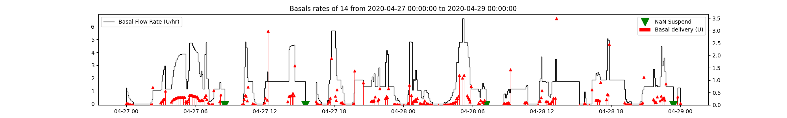
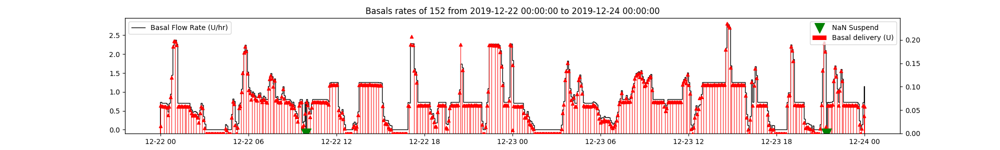
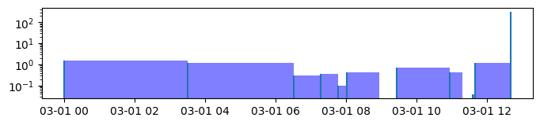
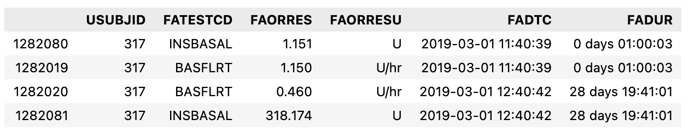

## Study

**Background:** Type 1 Diabetes EXercise Initiative: The Effect of Exercise on Glycemic Control in Type 1 Diabetes Study.  
**Devices:** Dexcom G6 CGM system and one of the following Pumps (AID or CSII) or MDI.

|Pump|Treatment|# patients|   
|----|----|-|
|MULTIPLE DAILY INJECTIONS |MDI|88|
|INSULET OMNIPOD INSULIN MANAGEMENT SYSTEM |CSII|106|
|TANDEM T:SLIM X2 WITH BASAL IQ |CSII|23|
|MEDTRONIC 670G IN MANUAL MODE |CSII|21|
|MEDTRONIC 630G |CSII|9|
|TANDEM T:SLIM X2 |CSII|8|
|TANDEM T:SLIM |CSII|5|
|MEDTRONIC PARADIGM 723 (REVEL) |CSII|4|
|MEDTRONIC 670G |CSII|3|
|MEDTRONIC 751 (530G) |CSII|2|
|MEDTRONIC 551 (530G) |CSII|2|
|MEDTRONIC PARADIGM 523 (REVEL) |CSII|1|
|INSULET OMNIPOD DASH |CSII|1|
|MEDTRONIC PARADIGM 522 |CSII|1|
|MEDTRONIC 770G |CSII|1|
|MEDTRONIC 640G |CSII|1|
|MEDTRONIC 670G IN AUTO MODE |CSII|1|
|TANDEM T:SLIM X2 WITH CONTROL IQ |AID|190|
|MEDTRONIC 670G IN AUTO MODE |AID|32|
|MEDTRONIC 770G IN AUTO MODE |AID|2|
|MEDTRONIC 770G |AID|1|

- A total of 502 patients are in the dataset. 
- Total number of days with data 13235
- Average of 26.79 days per patient


## Data
The files are in .xpt format (SAS Transport) files which are often used in clinical research and pharmaceutical datasets. We load this data using pandas as tabular data. The tables hold data of different types and therefore each specific type (basals, boluses, cgms,..) need to be extracted using the right column conditions.

## Glucose Data
**LB (lb.xpt)** - Laboratory Test Results The LB domain contains records for most recent HbA1c as reported by participant at baseline, and Dexcom G6 continuous glucose monitoring (CGM) data during study period. Dexcom G6 data is typically recorded once every five minutes

## DX.xpt Device Data
Device Exposure: DX domain contains records for participant indicated insulin modality selected at screening, and additional **information about the pump or closed loop system in use at baseline** if one of these modalities were indicated by participant.

Relevant columns:
- DXTRT = Device, USUBJID (patient id)
- The file contains two rows per patient: One with DXTRT being the pump name or *MULTIPLE DAILY INJECTIONS* and another one with the generic treatment type (INSULIN PUMP, CLOSED LOOP INSULIN PUMP, or MULTIPLE DAILY INJECTIONS). There is some quesiton about wether the generic types are correct for all patients.

## FACM: Basal and Bolus Data

**FACM** - Findings About Concomitant Medications FACM domain contains individual basal and bolus records, and basal flow rate, from participants’ personal insulin pump(s), as indicated in CM domain. 
Background: FACM structure: **FATEST** variables typically refer to Findings Test Name variables. It is typically paired with variables like **FATESTCD** (a short code for the test) and **FAORRES** (original result of the test). 

[3] provides a good overview about the columns


| **Column Name** | **Description** | **Notes/Code** |
|------------------|-----------------|----------------|
| `USUBJID`        | Patient ID      | - |
| `FATEST`         | Insulin Type | Separates between insulin types: BASAL INSULIN (deliveries in Units), BOLUS INSULIN (U), and BASAL FLOW RATES (U/hr). |
| `FADTC`          | Timestamp  | In seconds offset from 1960-01-01. `facm['FADTC'] = facm['FADTC'].apply(lambda x: datetime(1960, 1, 1) + timedelta(seconds=x) if pd.notnull(x) else pd.NaT)` |
| `FAORRES`        | Amount| Holds the insulin amount or delivery rate (depending on `FATEST` label). |
| `FADUR`          | Duration| (ISO format) of extended bolus or basal delivery. The `isodate` package is used to parse them.  `facm['FADUR'] = facm.FADUR.dropna().apply(isodate.parse_duration, as_timedelta_if_possible=True)` <br> - Some durations are extremely long (especially the last events) and should probably be removed. <br> - For some basal rates, the durations exceed the next basal rate (overlaps), which should be corrected (reason unclear). |
| `INSNMBOL`       | Normal bolus part.|  Often missing, especially for basal values. `FAORRES` needs to be used when this is missing. |
| `INSEXBOL`       | Extended bolus part. | When this value is not empty, it is associated with a `FADUR` value. |

Notes on other Columns
| **Column Name** | **Description** | **Notes** |
|------------------|-----------------|-----------|
| `FACAT`          | Insulin Category | Distinguishes between *BASAL* and *BOLUS* deliveries. Not needed, as it is consistent with `FATEST`. |
| `FAORRES`, `FASTRESC`, `FASTRESN` |Insulin Amount|`FAORRES`: Result or finding in original units. <br> `FASTRESC`: Character result/finding in standard format. <br> `FASTRESN`: Numeric result/finding in standard unit (0 values appear as `5.397605e-79`). <br> **We use `FAORRES`.** |
| `FAORRESU`, `FASTRESU` | Unit (Not needed)| `FAORRESU`: Original unit (`U` for basal deliveries or `U/hr` for basal flow rates). <br> `FASTRESU`: Standard unit (does not support `U/hr`, so it is NaN for basal flow rates).|
| `INSDVSRC`       | Insulin Source | Source of insulin delivery (Injections or Pump). Not needed for extraction. |
| `FAOBJ`          | Always "INSULIN". | Can be ignored. |
| `FATESTCD`       | Abbreviated version of `FATEST`. | We use `FATEST` because it is more explicit. |
| `INSTYPE`        | Insulin subtype (e.g., suspend, etc.). | - NaN when `INSDVSRC` is NaN or "Injections" and for some basal deliveries with pump source. <br> - Missing for many values, making it unreliable to select basal; **use `FATEST` instead.** |

### Boluses

- `FAORRES` contains the total bolus dose and always contains a value when FATEST=='BOLUS INSULIN'
- The FAORRES value is further split into the INSEXBOL (normal part) and INSMBOL (extended part) columns
    - When the bolus is an extended bolus, the delivery duration is given in FADUR
- Hoever, often only FAORRES contains a value and the other columns are empty!
    - It appears as if these boluses were not properly classified. 
    - This is true for at least 26% of the boluses
    - of these, almost all are normal boluses (based on instype, Durations are therefore always NaN) 
    - 2 Exceptions: 2 "square" part and 46 "combination"" boluses. We treat all of them as Normal because we don't have a duration.

#### Duplicates
- There are two duplicated bolus rows that should be dropped
In summary, we treat the FAORRESS orphans as normal boluses and assign them to INMBOL.


### Basal Rates
For all patients, basal is reported in two duplicate ways:
    - FATEST==BASAL INSULIN are basal deliveries, the FAORRES contains the total insulin (U)
    - FATES==BASAL FLOW RATE: are basal rates and FAORRESS contains a delivery rate (U/hr)
    - In both cases the FADUR is equal and contains the delivery duration
Delervies are probably calculated from the flow rates. Since both contain equivalent information, we only focus in the flow rates. 
Some durations are too long and overlap with subsequent deliveries and therefore need to be recalcualted, using the flow rates does not require recalculation of the dose. 

- The basal deliveries modulate the basal rate (U/hr)
- NaN flow rates happen in regions where flow rates are 0 and likely mark temporal suspensions





#### MDI basal flow rate rows

We did a quick check to see if Basal and Pump deliveries are in fact different in general. 

Bolus and Basal doses in MDI are of much larger value indicating injections which confirms that the data is consistent and flow rates can be discarded.

However, we found that in MULTIPLE DAILY INJECTIONS
 - BASAL INSULIN have NaN duration (probably because nobody wanted to make an assumption about the duration of insulin action)
 - All BASAL FLOW RATE are NaN valued (the basal injection couldn;t be converted to a flow rate due to missing duraiton)
- All these flow rates (16% of the MDI data) are compltely NaN valued

The time between injections could be taken as insulin action times.
]

As we can see there are several groups:
 1. around 0 hours (could be priming doses)
 2. <102h (half day insulin like levimir)
 3. around 24h (1 time injections like glargine)
 4. some around 48 hours (degludec) and possibly missed doses 

This seems reasonable. While we might miss some doses (either no injection happened or not logged), this seems to be a fair approximation. Further investigation could be done to correlate these fundings based on the basal insulin type.

We also see some priming doses and double injections (either looged twice or injected twice)

Taking the duration between basal injections as estimate for insulin action times, this causes problems when bolus injections are missing (e.g. not logged). For Patient 981, this problem looks severe (assuming that boluses were forgot to be logged). 


#### Duplicated Basal Rates
- We see temporal Boluses and Basal duplicates, what should we do?

 (in basal also with different durations altnerating between 0 and a bigger value). Let;s check how to get rid of them
#inspect duplicates

**What we found**:  
 - ~0.1 % duplicates
    - domindated by a handful of patients
 - Only basal duplicates (2 bolus exceptions) 
 - When duplciates exist, they exist for deliveries and flow rates
   - Assumption: once a incorrect flow rate was reported, the delivery was also incorrectly duplicated
- Duplciates show a pattern:
    - Duration: One row comes with 0 duration (probbaly wrong), the other row with a larger duration (that fits the start of the  next value)
    - Dose: The BASAL deliveries then also have a wrong entry with a zero FAORRES (amount) value (cant divide by zero)

How to deal with duplicates?
    - Only two bolsues, ignore.
    - Keep those with maximum duration. 


 #### Basal Overlaps
 An overlap occurs when the `FADTC` of one basal insulin entry falls within the time range (`FADTC` to `End_Time`) of another basal insulin entry. NetIOB Script [4] corrects these overlaps.
 
 What we found:

- Basal overlaps happen extremely rarely. 
- Why that is we don't know.
- In 0.07% of the cases, the next basal rate starts before the duration expires. Assuming that this is true (next basal rate replaces the previous one), we should recalculate the duration. However, we don't use the method from the NetIOB Script [4] which is overly complicated.

``` python
def overlaps(df):
    assert df.FADTC.is_monotonic_increasing
    end = df.FADTC + df.FADUR  
    next = df.FADTC.shift(-1)
    overlap = (next < end)
    return overlap
```


### Pump Consistencies 
From the NetIOB Script [4] we saw that some pumps were handled differently.  We took a look at this from different angles.

#### Inconsistent Basal bolus Events
 For example, we checked how much insulin types differed between insulin pumps.  What we found is that pumps report vastly different fractions of basal and boluses. 
 
 
 Here, we see the distributions between Tandem with Control IQ and 670G and 770G in Auto Mode (all AID).

t1dexi_bolus_amounts_three_pumps.png
770G reports many small (micro) boluses while Tandem seems to model these with continuous changes to the Basal Rate


These findings were not surprising and consistent with what we know about the systems. However, it indicated that some pump labels might be incorrect (eg. some 770G actually 770G in Auto Mode based on the fraction of events). 

#### Missing Durations?
In the net iob scripts, the 770G Basal (FACAT == Basal) duration (FADUR) was calculated manually as if it is missing.

**What we found is**  
- All durations, except for MDI have durations. 
- Durations, don't need to be calcualted manually.
- MDI durations need to be dropped.

#### Inconsistent Basal Selection
We see that there are different rules used between 670G and Tandem vs. 770G to select basal and boluses. Are there differences between the pumps and which column conditions to use?

Example from the NetIOB Script [4] (here code from the cunking method) showing differences in selecting basal based on pump type
**Tandem and 670G basal:** ```(main_df['FATEST'] == 'BASAL INSULIN') & (main_df['INSSTYPE'].isin(['scheduled', 'suspend', 'temp', 'automated']))```
**770G basal:** ```(main_df['FATEST'] == 'BASAL INSULIN')```

**What we found is:**  
- 770g has no insulin subtype
    - mostly boluses (does the AID system modulate it differently?)
    - Even 770g without "IN AUTO MODE" suffix (also in AID)?
 - Filtering INSTYPE for 'scheduled', 'suspend', 'temp', 'automated' would miss NaN rows
 - >16% of all basal insulin would have been missed, mostly MDI
 - The distribution confirms that these are mostly bigger mdi injections
 - The examples don't give reason to believe that they should be excluded (e.g. no duplicates)

 Conclusion: It appears that NaN Insulin Types should be includede (no filtering based on insulin type)!


#### Incorrect Pump Labels?

The NetIOB Script [4] does a correction to a pump label which made us question wether the pump labels and treatment types (AID, CSII, MDI) are actually correct.

>        # [Discretional]. We observed that subject ID: 766 device type should be 'MEDTRONIC 770G IN AUTO MODE' and we updated as such
>        device_data.loc[device_data['USUBJID'] == '766', 'DXTRT'] = 'MEDTRONIC 770G IN AUTO MODE'

However, in our data the user already had the correct label. Probably the dataset was updated over time.

#### CLOSED LOOP or not?
Based on the number of events, we see that for some pumps, some patients might be incorrectly assigned to AID or CSII.
- The average daily events varies significantly but shows clusters that can be attributed to the AID/CSII and MDI use.


- Tandem with Basal IQ shows much less events than other AIDs but more than CSII (this makes sens because it has comes with additional suspend events)
 - Some pumps are potential candidates for incorrect assignment
    - Some Tandem with Control IQ seem to be not in AID (1193,1444,5558,677 with <100 events/day)
    - One 770G outlier could be AID (subject 304 with 369 events/day in average)

### Suspends?
The question was wether suspend events are already reflected in the reported Basal Deliveries. 

We found that the number of suspends varies quite a bit between pumps. Even for the top 5 pumps with most data and mostly for the Tandem with Basal IQ. 


We took a look at how the suspend events look in context by plotting the surrounding data (the red markers indicate suspend events).


What we found:
- percentage of suspends is drastically different
    - highest in Tandem "with Basal IQ"
- insulin type suspend only exists for deliveries, but not in the flow rates.
    - However, suspends are also reflected in the flow rates.
- suspend FAORRESS values are are NaN or 0

How to work with Suspends:  
1. Don't need to be manually calculated
2. NaN values need to be replaced with zeros


### Corrupt data?
The NetIOB Script [4] removes some patient and date combinations. We investigated these patient by comparing them with the distributions (TDD, Durations, Number of events) of the overall dataset.


What we found:
- The selected dates show a lot of gaps (either no basal or only limited basal, some have a few boluses)
- Some of the patients stand out with very little data and very high TDDs
- The high TDDs, could be traced to extremely high delivery durations (DAFUR > 1 day) 
    - This causes wrong high basal deliveries
    - High durations mostly happen as last basal value




However, other dates and patients show similar trends
    - We believe these dates and patients were surprise findings and there is no general rule to apply here

**Conclusion**  
 - There is no general trend that would support removing these patients or dates, they seem to be surprise findings
 - Thenumber of days or datapoints/patient could be be a better criterion to exclude patients
 - Extremely long durations might need to be removed
 - Some might be automatically resolved by using the overlap-removal discussed earlier


### Summary
#### Bolus
- two duplicated rows should be dropped
- FAORRESS must be assigned to INSMBOL if  INSMBOL is empty
- We see ~1k rows where FAORRES< INSEXBOL or INSMBOL is very small (5.397605e-79) and should be replaced with zero
-split extended and normal boluses


#### Basal  
##### Pump  
    - We should work with flow rates only
    - overlapping basal rates need to be corrected
    - suspends don't need to be factored in
    - extremely long durations should probably be removed (after overlaps are corrected)
    - NaN Flow rates should be replaced with 0s as they seem to mark suspensions
    - duplicated basal rows should be dealt with by taking the row with the maximum dose
    - insstype should not be used to select basal rows (this misses many basal rows with NaN insulin subtype)

##### MDI  
    - MDI basal flow rates (all NaN) need to be dropped
    - MDI basal injections miss duration which should be guessed from the insulin action profile (if available or by taking the time until the next injection). Alternatively, we could use the median duration as an estimate for the acting time. Or check if there is a table with basal insulin type information.
    - there are priming doses and double injections but we keeo these for now

#### Open Questions
 - Some patient pumps are potentially incorrectly assigned to AID or CSII
     - However, this does not impact out analysis at the moment.
 - Some patients and dates were removed in the netiob script but 
    - the rules for these are yet unclear and we believe these were "surprise findings"
    - While some show as outliers (e.g. very little data), not other patients show similar trends 
    - 
- Users with very little data might need to be removed 
- How to deal with mdi basal injections and conversion to flow rates. The current solution seems sub-optimal.

## Sources
Files that explain columns and data files:  
 1. defineXML.html (data file documentation)
 2. T1DEXI SDRG_15Sept2022.pdf (data file descriptions)
 3. T1DEXI ACRF_15Sept2022.pdf (relationships between facm columns)
 4. https://gitlab.com/CeADARIreland_Public/netiob
