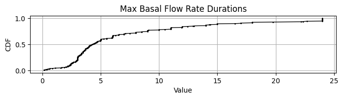
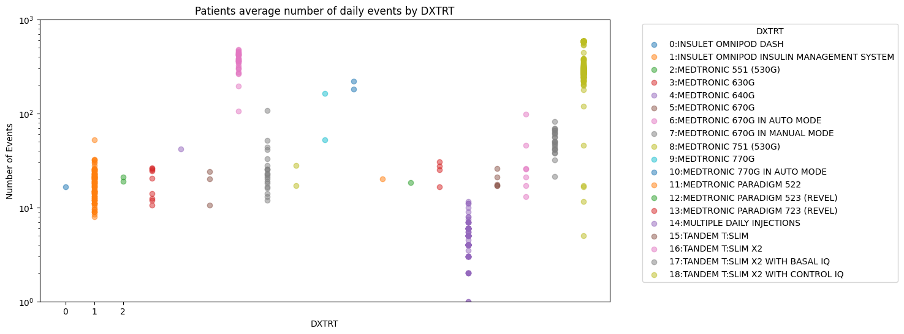
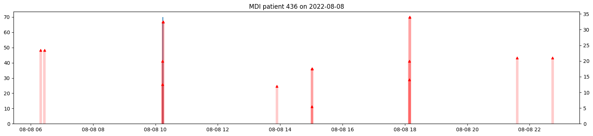
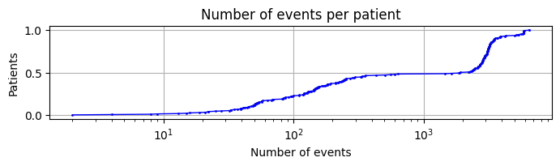

# T1DEXIP (Pediatric) 
This page summarizes our insights about the clinical study data of the **T1DEXIP (Pediatric)** study in efforts to understand how to handle bolus, basal and cgm data as well as assumptions that were made as well as open questions. 

The full analysis of this dataset is provided in: `notebooks/understand-t1dexi-dataset/2025-01-30 - Understand Insulin Data Structures T1DEXIP.ipynb`

## Study Overview
- **Study Name**: Type 1 Diabetes EXercise Pediatrics Initiative (T1Dexi):
The Effect of Exercise on Glycemic Control in Youth with Type 1 Diabetes
- **Background:** Understanding of the effects of different forms of physical activity on
acute glycemia and on insulin and carbohydrate needs to better maintain
euglycemia during and after exercise in youth with type 1 diabetes
- **Population:** 245 pediatric pateitns, age 12 – <18 years
- **Study Duration**: approximately 10 days
- **Data:** There are roughly 2500 patient days of data

### Devices

|Device|Treatment Type *| Number of Users|
|-|-|-|
|MULTIPLE DAILY INJECTIONS |MDI|37|
|INSULET OMNIPOD DASH |CSII|42|
|INSULET OMNIPOD INSULIN MANAGEMENT SYSTEM |CSII|29|
|MEDTRONIC 770G IN MANUAL MODE |CSII|1|
|TANDEM T:SLIM X2 |CSII|1|
|TANDEM T:SLIM X2 WITH BASAL IQ |CSII|1|
|TANDEM T:SLIM X2 WITH CONTROL IQ |AID|132|
|INSULET OMNIPOD 5 |AID|12|
|MEDTRONIC 770G IN AUTO MODE |AID|5|
|MEDTRONIC 670G IN AUTO MODE |AID|1|
|TANDEM T:SLIM X2 WITH BASAL IQ |AID|1|

## Differences T1DExi vs. T1DExip

The structure of T1DEXI and T1DEXIP are almost identical. However, the T1DExiP dataset appears even a little clearner than the T1DExi dataset: Here are some of the differences:

 ### Basal Flow rates
 - MDI has no flow rates
 - No NaN FAORRES or NaN duraitons: no need to fill with zeros
 - basal flow rates and basal deliveries are almost identical but overall deivate a little more (70 Units overall)
- There are no extreme basal durations (all below 24h) and no resulting extreme basal flow rates
 - These are likely true Basal rates that are set for a whole day 

The figure below shows that flow rates don't exceed large values and basal durations a maximum of 24 hours.

### AID Labels
- It looks like only the Tandem T:SLIM X2 with control IQ was really running in AID mode. In the figure we can see that only this pump shows significanly more than 100 events/day (as an arbitary cut-off between CSII and AID).

### Suspends
- suspend events are all zero values, and no NaNs (no need to replace)

### Duplicates
- Basal
    - Same, we see some alternating basals: use maximum duration
- Bolus
    - no complete duplicated bolus rows (instead of 2)
    - Some MDI appear to have (close) duplicated recordings causing high TDDs
- MDI patients with highest TDD appears to have duplicated bolus records

The figure below shows boluses and basals (large 70U basal injection at 10:00 in blue)
of patient 436 on 2022-08-08 which (having TDD on that day > 400 Units) appears to have multiple logs of the same bolus injection.

### Number of Data Points

The figure shows that there are many patients with very little data (likely MDI and those which didn't stay in the study long enough) and some with huge amounts (likely patients with AID).   

- T1DExip, also some patients have much less datapoints due to less number of days than study duration (<10>)

### Glucose
- there is one sample with a value >401 mg/dl
- some 8 temporal duplicates that can be dropped using first